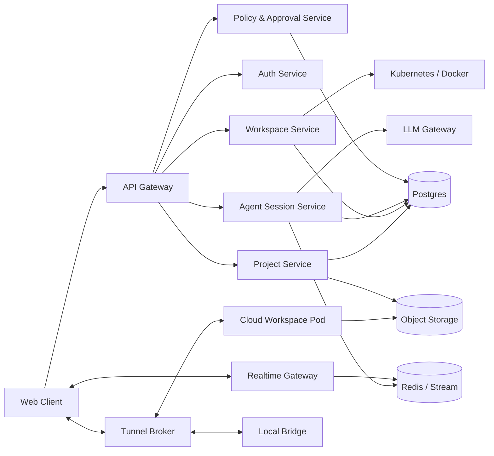
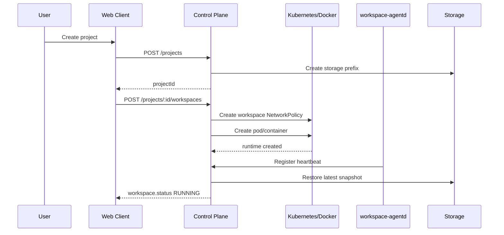
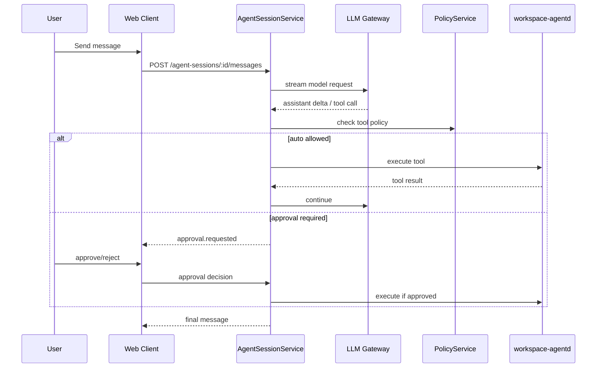

# AIYolo

AIYolo 是一个“云原生 Agentic IDE + 混合计算架构”工作空间。目标是让用户在浏览器中完成 AI 开发、实验、数据分析和代码协作，同时把云端隔离算力、本地资源、安全授权、Agent 自动化和实时可观测性组织成一个可实现、可扩展的系统。

本文档按“可以直接实现”的粒度描述整体架构、组件职责、内部模块、接口协议、数据模型、安全边界和 MVP 路线。

## 1. 产品边界

### 1.1 核心目标

- 在 Web 中提供类 Cursor/VS Code/Codespaces 的 AI 工作台：聊天、文件树、代码编辑器、终端、端口预览、Notebook、数据视图。
- 为每个项目按需启动隔离的云端 Workspace，运行代码、Agent、终端命令和开发服务。
- 支持本地 Bridge，把用户授权的本地文件、浏览器、端口和命令能力安全暴露给云端 Agent。
- 将 Agent 的执行计划、工具调用、命令输出、文件变更和权限请求实时展示给用户。
- 持久化项目文件、会话历史、运行产物、授权记录和审计日志。

### 1.2 非目标

- 第一阶段不实现完整 VS Code 扩展生态，只提供核心编辑、终端、端口、Notebook 和 Agent 能力。
- 第一阶段不让 Agent 默认拥有本地全盘访问权限，所有高风险本地能力必须显式授权。
- 第一阶段不做复杂多人实时协同编辑，可先实现项目分享和只读协作。
- 第一阶段不自行训练大模型，通过 LLM Gateway 接入 OpenAI、Anthropic、本地模型或企业模型网关。

## 2. 总体架构

系统由五个层面组成：

1. **Web Client**：用户入口，负责交互、编辑、展示和审批。
2. **Control Plane**：控制平面，负责鉴权、调度、会话、信令、路由和策略。
3. **Cloud Workspace**：云端隔离运行环境，负责代码执行、Agent 运行、终端、端口和文件变更。
4. **Local Bridge**：本地守护进程，负责本地资源暴露、双向隧道、浏览器控制和本地端口转发。
5. **Storage & Observability**：持久化、事件流、审计、指标、日志和回放。



## 3. 信任边界与安全模型

### 3.1 信任边界

- **浏览器边界**：浏览器只持有短期访问令牌，不直接持有云厂商密钥、模型密钥或用户长期凭据。
- **控制平面边界**：控制平面可信，负责策略判断、资源调度、签发短期令牌和记录审计。
- **Workspace 边界**：Workspace 默认不可信。Agent 代码、用户项目代码和 shell 命令都在隔离环境中执行。
- **本地边界**：Local Bridge 运行在用户设备上，默认不信任云端请求，必须验证会话、用户授权和能力范围。
- **模型边界**：外部模型输出不可信，所有工具调用都需要经过策略层校验。

### 3.2 权限原则

- 最小权限：Agent 会话启动时只拥有项目内读写、终端和模型调用等基础能力。
- 分级授权：低风险操作自动执行，高风险操作进入 Human-in-the-loop。
- 可撤销：用户可以随时撤销 Local Bridge、项目、Agent 会话或单项工具权限。
- 可审计：所有工具调用、审批、文件写入、端口暴露和本地访问都生成审计日志。

### 3.3 权限等级

| 等级 | 示例 | 默认策略 |
| --- | --- | --- |
| L0 只读低风险 | 读取项目内文件、列目录、读取终端输出 | 自动允许 |
| L1 项目内写入 | 修改项目文件、创建文件、安装依赖 | 可配置自动允许，默认首次确认 |
| L2 执行命令 | 运行测试、启动服务、执行脚本 | 需要命令预览，可按会话授权 |
| L3 网络/密钥 | 访问外网、读取环境变量、调用第三方 API | 每类能力单独授权 |
| L4 本地资源 | 读写本地文件、控制本地浏览器、本地端口映射 | 必须显式授权，默认拒绝 |
| L5 危险操作 | 删除大量文件、访问敏感路径、执行破坏性命令 | 强制逐次确认 |

## 4. 组件设计

### 4.1 Web Client

#### 4.1.1 职责范围

Web Client 是统一用户界面，负责项目管理、Agent 交互、文件编辑、终端展示、端口预览、权限审批、Local Bridge 状态和模型配置。它不直接执行业务逻辑，只通过 REST API、Realtime WebSocket 和 Tunnel Broker 与后端交互。

#### 4.1.2 推荐技术栈

- Next.js App Router
- TypeScript
- Tailwind CSS
- Zustand 或 Jotai 管理局部 UI 状态
- TanStack Query 管理服务端状态
- Monaco Editor 作为代码编辑器
- Xterm.js 作为终端视图
- Yjs 可作为后续协同编辑基础，MVP 可不启用

#### 4.1.3 页面结构

```text
/login
/projects
/projects/:projectId
/projects/:projectId/workspaces/:workspaceId
/projects/:projectId/settings
/bridge/pair
```

#### 4.1.4 主工作台布局

主工作台采用固定应用框架：

- 左侧 Activity Bar：Explorer、Search、Runs、Ports、Settings。
- 左侧 Sidebar：文件树、搜索结果、Agent 会话列表。
- 中央 Editor Area：Monaco、多 Tab、Notebook、Diff 视图。
- 右侧 Agent Panel：聊天、执行计划、工具调用、审批卡片。
- 底部 Panel：终端、任务输出、问题列表、端口列表。
- 顶部 Status Bar：Workspace 状态、Bridge 状态、模型、Token 用量、同步状态。

#### 4.1.5 内部模块

| 模块 | 功能 | 输入 | 输出 |
| --- | --- | --- | --- |
| `AuthShell` | 登录态、令牌刷新、路由保护 | access token、refresh token | 用户上下文 |
| `ProjectDashboard` | 项目列表、创建、导入、删除 | Project API | 项目卡片列表 |
| `WorkspaceShell` | 工作台布局、面板状态、快捷键 | workspaceId | 完整 IDE UI |
| `FileExplorer` | 文件树、创建、重命名、删除、上传 | File API / file events | 文件操作事件 |
| `EditorTabs` | 打开文件、多标签、dirty 状态、保存 | 文件内容、Monaco model | save 请求、diff 请求 |
| `TerminalPanel` | 终端会话创建、输入、输出、resize | terminal events | PTY 输入事件 |
| `AgentPanel` | 用户消息、流式回答、工具调用、计划展示 | agent events | agent command 请求 |
| `ApprovalCenter` | 权限请求、风险说明、批准/拒绝 | approval events | approval decision |
| `PortsPanel` | 云端端口、本地端口、预览链接 | port events | open/close/tunnel 请求 |
| `BridgePanel` | 配对、心跳、能力管理 | bridge events | pairing/permission 请求 |
| `SettingsPanel` | 模型、密钥、环境变量、策略 | settings API | 更新后的配置 |

#### 4.1.6 前端状态划分

- **服务端状态**：用户、项目、Workspace、文件元信息、会话历史，用 TanStack Query 缓存。
- **实时状态**：终端输出、Agent token、工具状态、文件变更、端口变化，通过 WebSocket event reducer 写入本地 store。
- **编辑器状态**：打开的 tab、光标位置、折叠、dirty buffer，保存在 IndexedDB，定期同步到后端。
- **临时 UI 状态**：面板宽度、当前 tab、筛选器，用 Zustand 持有。

#### 4.1.7 WebSocket 事件处理

前端只维护一条 Realtime 连接，每个事件必须有递增序号，用于断线重连后补齐。

```ts
type RealtimeEnvelope = {
  eventId: string;
  seq: number;
  projectId: string;
  workspaceId?: string;
  sessionId?: string;
  type: string;
  payload: unknown;
  createdAt: string;
};
```

前端 reducer 按 `type` 分发：

- `workspace.status.changed`
- `file.changed`
- `file.conflict.detected`
- `terminal.output.appended`
- `agent.message.delta`
- `agent.tool.started`
- `agent.tool.finished`
- `agent.guardrail.triggered`
- `approval.requested`
- `approval.resolved`
- `port.detected`
- `bridge.status.changed`
- `error.reported`

#### 4.1.8 前端实现顺序

1. 登录、项目列表、创建项目。
2. 工作台 Shell 和基础布局。
3. 文件树、Monaco 打开/保存。
4. Realtime 连接和事件日志面板。
5. 终端面板。
6. Agent Panel 文本对话。
7. 工具调用展示和审批卡片。
8. 端口列表和预览。
9. Bridge 配对与能力管理。

### 4.2 Control Plane

#### 4.2.1 职责范围

Control Plane 是系统的大脑，负责所有控制类逻辑：认证、项目、Workspace 生命周期、Agent 会话、LLM 调用、工具授权、实时事件、隧道信令、审计和资源策略。它不直接运行用户代码。

#### 4.2.2 推荐技术栈

- 单体优先：NestJS 或 Go + Chi/Fiber。
- 数据库：Postgres。
- 缓存与实时流：Redis。
- 对象存储：S3/MinIO。
- 异步任务：BullMQ、Temporal 或轻量 job worker。
- API：REST + WebSocket，内部服务可用 gRPC。

MVP 推荐使用模块化单体，避免过早拆微服务。后续按负载拆分 Realtime Gateway、Workspace Service、LLM Gateway 和 Tunnel Broker。

#### 4.2.3 内部服务模块

| 模块 | 职责 | 数据依赖 | 外部依赖 |
| --- | --- | --- | --- |
| `AuthService` | 登录、OAuth、令牌刷新、组织成员 | users、sessions | OAuth provider |
| `ProjectService` | 项目 CRUD、成员、设置、导入导出 | projects、members | Object Storage |
| `WorkspaceService` | 创建/暂停/恢复/销毁 Workspace | workspaces | Kubernetes/Docker |
| `AgentSessionService` | Agent 会话、消息、工具调用编排 | agent_sessions、messages | LLM Gateway |
| `LLMGateway` | 模型路由、流式调用、用量统计 | model_configs、usage | OpenAI/Anthropic/local |
| `ToolPolicyService` | 工具权限判断、风险分级、审批 | policies、approval_requests | Realtime Gateway |
| `RealtimeGateway` | WebSocket 接入、事件广播、补偿 | event_log | Redis |
| `TunnelBroker` | Bridge 和 Workspace 信令、连接注册 | tunnel_connections | WebSocket/WebRTC |
| `StorageManager` | 快照、文件对象、artifact、日志归档 | file_snapshots | S3/MinIO |
| `AuditService` | 审计日志、查询、导出 | audit_logs | Object Storage |

#### 4.2.4 核心 REST API

所有接口使用 `/api/v1` 前缀，认证使用 Bearer token。

##### Auth

```text
POST   /api/v1/auth/login
POST   /api/v1/auth/logout
POST   /api/v1/auth/refresh
GET    /api/v1/me
```

##### Projects

```text
GET    /api/v1/projects
POST   /api/v1/projects
GET    /api/v1/projects/:projectId
PATCH  /api/v1/projects/:projectId
DELETE /api/v1/projects/:projectId
GET    /api/v1/projects/:projectId/files?path=/src
GET    /api/v1/projects/:projectId/files/content?path=/README.md
PUT    /api/v1/projects/:projectId/files/content
POST   /api/v1/projects/:projectId/files/rename
DELETE /api/v1/projects/:projectId/files?path=/tmp.txt
```

##### Workspaces

```text
POST   /api/v1/projects/:projectId/workspaces
GET    /api/v1/projects/:projectId/workspaces
GET    /api/v1/workspaces/:workspaceId
POST   /api/v1/workspaces/:workspaceId/start
POST   /api/v1/workspaces/:workspaceId/stop
POST   /api/v1/workspaces/:workspaceId/restart
DELETE /api/v1/workspaces/:workspaceId
GET    /api/v1/workspaces/:workspaceId/status
```

##### Agent Sessions

```text
POST   /api/v1/workspaces/:workspaceId/agent-sessions
GET    /api/v1/workspaces/:workspaceId/agent-sessions
GET    /api/v1/agent-sessions/:sessionId
POST   /api/v1/agent-sessions/:sessionId/messages
POST   /api/v1/agent-sessions/:sessionId/cancel
GET    /api/v1/agent-sessions/:sessionId/tool-calls
```

##### Terminals

```text
POST   /api/v1/workspaces/:workspaceId/terminals
GET    /api/v1/workspaces/:workspaceId/terminals
POST   /api/v1/terminals/:terminalId/input
POST   /api/v1/terminals/:terminalId/resize
DELETE /api/v1/terminals/:terminalId
```

终端高频输入输出走 WebSocket，REST 只用于创建和控制。

##### Approvals

```text
GET    /api/v1/approvals?status=pending
POST   /api/v1/approvals/:approvalId/approve
POST   /api/v1/approvals/:approvalId/reject
POST   /api/v1/approvals/:approvalId/grant-scope
```

##### Bridge & Tunnel

```text
POST   /api/v1/bridges/pairing-codes
POST   /api/v1/bridges/pair
GET    /api/v1/bridges
PATCH  /api/v1/bridges/:bridgeId/capabilities
DELETE /api/v1/bridges/:bridgeId
GET    /api/v1/workspaces/:workspaceId/ports
POST   /api/v1/workspaces/:workspaceId/ports/:portId/expose
DELETE /api/v1/workspaces/:workspaceId/ports/:portId/expose
```

#### 4.2.5 Realtime API

```text
GET /api/v1/realtime?projectId=:projectId&lastSeq=:lastSeq
```

认证成功后，服务端返回：

```json
{
  "type": "connection.ready",
  "payload": {
    "connectionId": "rt_123",
    "serverTime": "2026-05-12T00:00:00Z",
    "nextSeq": 42
  }
}
```

客户端可发送：

```json
{
  "type": "client.ping",
  "requestId": "req_1",
  "payload": {}
}
```

服务端事件必须写入 `event_log` 后再广播，保证断线后可以通过 `lastSeq` 补偿。

#### 4.2.6 Agent 编排流程

1. 用户发送消息到 `AgentSessionService`。
2. 服务读取项目上下文、打开文件、最近事件、用户策略和模型配置。
3. 服务构造 Agent prompt 和工具 schema。
4. `LLMGateway` 发起流式模型调用。
5. 模型请求工具时，`ToolPolicyService` 判断是否可自动执行。
6. 需要审批时创建 `approval_request` 并暂停工具调用。
7. 审批通过后，工具调用路由到 Workspace 或 Local Bridge。
8. 工具结果回传给模型，继续生成。
9. 会话结束后持久化消息、工具调用、文件变更摘要和用量。

#### 4.2.7 Workspace 调度状态机

```text
CREATED -> STARTING -> RUNNING -> IDLE -> SUSPENDING -> SUSPENDED
RUNNING -> STOPPING -> STOPPED
RUNNING -> ERROR
ERROR -> STARTING
SUSPENDED -> RESUMING -> RUNNING
```

状态定义：

- `CREATED`：数据库记录已创建，尚未分配运行环境。
- `STARTING`：镜像拉取、PVC 挂载、Workspace 专属 NetworkPolicy 下发、Pod 创建中。
- `RUNNING`：Agent Daemon 心跳正常，可接收命令。
- `IDLE`：无前台交互且不满足保活条件，可进入暂停倒计时。
- `SUSPENDING`：正在保存状态、停止进程。
- `SUSPENDED`：运行环境释放，文件和快照保留。
- `ERROR`：启动失败、心跳丢失或调度异常。

空闲判定补充规则：

- 除前台终端、Agent 和已暴露端口外，还要结合最近 CPU/内存占用、活跃子进程、最近 stdout/stderr 和后台任务标记判定。
- 若检测到训练、爬虫、构建等长任务仍在运行，则保持 `RUNNING` 并重置 idle timer。
- 用户可以对单个 Workspace 设置 `keepAliveUntil` 或手动 pin，作为显式保活信号。

### 4.3 Cloud Workspace

#### 4.3.1 职责范围

Cloud Workspace 是每个项目的隔离运行环境。它运行用户代码、终端命令、Agent 工具调用和开发服务，并将文件变更、进程输出、端口发现和资源指标推回控制平面。

#### 4.3.2 运行形态

MVP 可以使用 Docker container；生产建议使用 Kubernetes Pod。每个 Workspace 至少包含一个主容器：

- `workspace-runtime`：用户代码、shell、语言运行时、Agent Daemon。

后续可拆成 sidecar：

- `agent-daemon` sidecar：负责控制通道、文件监听、PTY、端口扫描。
- `proxy` sidecar：负责端口转发和流量统计。
- `sync` sidecar：负责快照和对象存储同步。

#### 4.3.3 基础镜像

建议先提供三类镜像：

| 镜像 | 内容 | 适用场景 |
| --- | --- | --- |
| `aiyolo/base-node` | Ubuntu、Node.js、pnpm、git、ripgrep | 前端/Node 项目 |
| `aiyolo/base-python` | Python、uv、pip、Jupyter、common ML libs | Python/数据项目 |
| `aiyolo/base-full` | Node、Python、Docker CLI、Jupyter | 通用 AI 开发 |

镜像内必须预装：

- `git`
- `curl`
- `ripgrep`
- `tar`/`zip`
- `bash`
- `workspace-agentd`
- 可选：`node`、`python`、`uv`、`pnpm`、`jupyter`

#### 4.3.4 Workspace Agent Daemon

`workspace-agentd` 是运行在 Workspace 内的守护进程，负责把控制平面的请求落到容器中执行。

内部模块：

| 模块 | 职责 |
| --- | --- |
| `ControlClient` | 与 Control Plane 建立 mTLS/WebSocket 连接，接收命令，发送事件 |
| `FileService` | 读写文件、列目录、计算 diff、应用 patch、监听变更 |
| `TerminalService` | 创建 PTY、转发输入输出、resize、kill |
| `ProcessService` | 执行非交互命令、管理任务、采集 exit code |
| `PortScanner` | 发现监听端口、上报服务元信息 |
| `PortProxy` | 将容器端口流量接入 Tunnel Broker |
| `MCPAdapter` | 将文件、终端、搜索、浏览器代理等能力包装成 MCP 工具 |
| `MetricsReporter` | 上报 CPU、内存、磁盘、网络、进程数量 |
| `SnapshotClient` | 周期性上传快照、恢复项目文件 |

#### 4.3.5 文件系统布局

```text
/workspace
  /project              # 用户项目根目录
  /.aiyolo
    /agent              # agent 临时文件
    /logs               # daemon 和任务日志
    /snapshots          # 本地快照缓存
    /ports.json         # 端口发现缓存
    /env                # 注入的非敏感环境配置
```

敏感信息不写入项目目录；密钥通过运行时 Secret 注入，且默认不允许 Agent 读取全部环境变量。

#### 4.3.6 Daemon 命令协议

控制平面到 Daemon 的命令统一使用 RPC envelope：

```json
{
  "requestId": "req_123",
  "workspaceId": "ws_123",
  "type": "file.read",
  "payload": {
    "path": "/workspace/project/README.md"
  },
  "deadlineMs": 30000
}
```

响应：

```json
{
  "requestId": "req_123",
  "ok": true,
  "payload": {
    "content": "...",
    "sha256": "..."
  },
  "error": null
}
```

错误：

```json
{
  "requestId": "req_123",
  "ok": false,
  "payload": null,
  "error": {
    "code": "FILE_NOT_FOUND",
    "message": "path does not exist",
    "retryable": false
  }
}
```

#### 4.3.7 支持的 Daemon 命令

```text
file.list
file.read
file.write
file.patch
file.rename
file.delete
file.watch
search.rg
terminal.create
terminal.input
terminal.resize
terminal.kill
process.exec
process.cancel
ports.list
ports.expose
ports.unexpose
metrics.read
snapshot.create
snapshot.restore
```

#### 4.3.8 端口暴露

端口发现策略：

- Daemon 每 2 秒扫描监听端口。
- 新端口上报 `port.detected` 事件。
- 前端展示端口、协议猜测、进程信息和公开状态。
- 用户点击预览时，Control Plane 创建短期 signed URL。
- Tunnel Broker 将浏览器请求转发到 Workspace `PortProxy`。

端口对象：

```ts
type WorkspacePort = {
  id: string;
  workspaceId: string;
  port: number;
  protocol: "http" | "https" | "tcp";
  processName?: string;
  visibility: "private" | "shared" | "public";
  url?: string;
  detectedAt: string;
};
```

### 4.4 Local Bridge

#### 4.4.1 职责范围

Local Bridge 是运行在用户电脑上的守护进程，负责把用户授权的本地能力提供给云端：本地文件访问、本地端口访问、本地浏览器自动化、本地 shell 沙箱和本地工具 MCP Server。Bridge 必须以最小权限运行，并把所有云端请求显示为可审计事件。

#### 4.4.2 推荐技术栈

- Rust + Tauri：适合桌面 UI、跨平台分发和系统能力控制。
- 或 Go：适合单文件 CLI、网络隧道和后台服务。

MVP 可以先做 CLI：`aiyolo bridge pair`、`aiyolo bridge status`、`aiyolo bridge allow`。

#### 4.4.3 内部模块

| 模块 | 职责 |
| --- | --- |
| `PairingClient` | 使用短期 pairing code 绑定用户账号和设备 |
| `AuthStore` | 保存设备私钥、刷新令牌和 bridgeId，使用系统 keychain |
| `TunnelClient` | 连接 Tunnel Broker，维护心跳和重连 |
| `CapabilityRegistry` | 注册本地能力和授权范围 |
| `PolicyEngine` | 判断云端请求是否命中本地授权策略 |
| `LocalFileProvider` | 受限读写用户指定目录 |
| `LocalPortForwarder` | 本地端口到云端/云端端口到本地的映射 |
| `BrowserController` | 控制本地 Chrome/Chromium，支持截图、导航、点击、读取 DOM |
| `LocalShellSandbox` | 可选的本地命令沙箱，默认关闭 |
| `AuditBuffer` | 本地记录请求、结果、拒绝原因，断网后补传 |

#### 4.4.4 配对流程

1. 用户在 Web 端点击“连接本地设备”。
2. Control Plane 创建 6 位或 8 位 pairing code，有效期 5 分钟。
3. 用户在本地执行 `aiyolo bridge pair <code>`。
4. Bridge 调用 `/bridges/pair`，提交设备公钥、设备名、平台信息。
5. Control Plane 生成 `bridgeId` 和短期 token，之后使用设备密钥轮换刷新。
6. Bridge 与 Tunnel Broker 建立长连接，上报心跳和能力列表。
7. Web 端显示 Bridge 在线，用户选择允许的目录、浏览器和端口能力。

#### 4.4.5 本地能力模型

```ts
type BridgeCapability = {
  id: string;
  bridgeId: string;
  kind:
    | "local.files.read"
    | "local.files.write"
    | "local.browser.control"
    | "local.ports.read"
    | "local.ports.forward"
    | "local.shell.exec";
  scope: {
    paths?: string[];
    ports?: number[];
    browserProfiles?: string[];
    commandAllowlist?: string[];
  };
  expiresAt?: string;
  enabled: boolean;
};
```

#### 4.4.6 本地请求策略

- Bridge 收到云端请求后，先验证 token、workspaceId、sessionId 和签名。
- 再检查 capability 是否允许该操作。
- 高风险操作仍需本地弹窗或 Web Approval 二次确认。
- 所有返回结果必须限制大小；默认 inline payload 建议不超过 256 KB。
- 大文件、二进制结果和批量目录扫描结果不通过单条 WebSocket 消息回传，而是返回 `streamId` 或短期 signed URL，再按块拉取。
- 分块传输需要支持背压和超时，建议单块 1-4 MB，并对总传输量设置会话级上限。
- 默认屏蔽常见敏感路径，例如 `~/.ssh`、`~/.gnupg`、浏览器密码库、系统密钥目录。

### 4.5 LLM Gateway 与 Agent Runtime

#### 4.5.1 职责范围

LLM Gateway 统一模型接入、路由、重试、限流、用量统计和工具调用协议适配。Agent Runtime 负责任务循环、上下文组装、工具执行和结果落库。

#### 4.5.2 模型路由

模型配置分为三层：

- 系统默认模型：平台提供。
- 项目模型：项目级覆盖，例如默认 coding model、analysis model。
- 会话模型：用户在当前 Agent 会话中选择。

路由策略：

```text
request purpose -> model policy -> provider adapter -> streaming response
```

用途示例：

- `chat`：通用对话。
- `code_edit`：代码修改。
- `tool_plan`：工具规划。
- `summarize`：日志和文件摘要。
- `vision`：截图和图片理解。

#### 4.5.3 Agent Runtime 循环

```text
UserMessage
  -> BuildContext
  -> CallModel(stream)
  -> ModelDelta events
  -> ToolCall requested
  -> PolicyCheck
  -> Approval if needed
  -> ExecuteTool
  -> PersistToolResult
  -> ContinueModel
  -> FinalMessage
```

#### 4.5.4 工具接口

工具统一描述为：

```ts
type AgentTool = {
  name: string;
  description: string;
  riskLevel: "L0" | "L1" | "L2" | "L3" | "L4" | "L5";
  inputSchema: JsonSchema;
  outputSchema?: JsonSchema;
  target: "workspace" | "local_bridge" | "control_plane";
  timeoutMs: number;
};
```

MVP 工具集：

```text
workspace.file.read
workspace.file.write
workspace.file.patch
workspace.file.list
workspace.search.rg
workspace.terminal.exec
workspace.terminal.create
workspace.ports.list
control.project.read
control.approval.request
local.file.read
local.browser.screenshot
local.browser.navigate
```

#### 4.5.5 上下文构建

Agent 每轮请求不应把全部项目塞进模型，而是分层构建上下文：

1. 系统规则和项目策略。
2. 当前用户消息。
3. 最近 N 条对话摘要。
4. 当前打开文件和选区。
5. 最近文件变更摘要。
6. 相关文件检索结果。
7. 最近命令输出摘要。
8. 可用工具清单和权限状态。

长会话需要定期生成 `conversation_summary`，避免上下文无限增长。

#### 4.5.6 执行护栏

为避免 Agent 在错误上下文中反复调用模型和工具，每个会话应绑定 budget policy：

- `maxInputTokens`、`maxOutputTokens`、`maxToolCalls`、`maxRuntimeMs`、`maxApprovalWaitMs`。
- 同一命令或测试失败如果在短窗口内出现相同错误指纹超过 3 次，系统触发熔断。
- 命中预算上限或重复失败熔断时，暂停会话、写入系统消息、发出 `agent.guardrail.triggered` 事件，并要求用户选择继续、调整策略或结束会话。

### 4.6 Storage & Persistence

#### 4.6.1 存储分类

| 类型 | 存储 | 内容 |
| --- | --- | --- |
| 关系数据 | Postgres | 用户、项目、会话、权限、审计索引 |
| 短期状态 | Redis | WebSocket 连接、事件流、锁、任务队列 |
| 文件对象 | OSS/S3/MinIO | 项目快照、附件、运行产物、日志归档、大文件数据集 |
| Workspace 卷 | PVC/volume | 活跃运行时文件系统、代码、小文件 |
| 本地缓存 | IndexedDB | 前端编辑器状态、最近打开文件 |

#### 4.6.2 ACK 存储落地方案

阿里云 ACK 可作为开发和生产环境的统一运行底座，dev/prod 通过 namespace、Secret、ConfigMap、StorageClass 和资源配额隔离。存储按访问模式分层：

- 代码、配置、依赖缓存、会话元数据、终端临时文件和少量频繁读写的小文件放在块存储 PVC 上，挂载到 Workspace Pod 的 `/workspace` 或子目录。
- 大量文件、数据集、模型产物、Notebook 输出、长期日志归档和快照对象放到 OSS，并以 S3 兼容接口或 CSI/mount 方式挂载到 Workspace。
- OSS 可以共享同一个 bucket，通过用户级目录前缀隔离，例如 `oss://aiyolo-data/users/:userId/projects/:projectId/`。
- Workspace 只允许访问当前用户和项目的 OSS 前缀，Control Plane 负责签发短期凭证或注入受限 RAM Role。
- 不依赖 OSS mount 承载高频小文件随机写、文件锁、数据库状态或需要强 POSIX 语义的目录，这类数据继续使用块存储 PVC 或托管服务。

推荐 Workspace 内部目录：

```text
/workspace/project        # 块存储 PVC：代码、配置、小文件、活跃编辑区
/workspace/cache          # 块存储 PVC：依赖缓存、语言服务缓存、临时构建缓存
/workspace/data           # OSS mount：数据集、大文件、长期产物
/workspace/artifacts      # OSS mount：运行产物、模型检查点、Notebook 输出
```

#### 4.6.3 项目持久化策略

MVP 推荐使用“对象存储快照 + 活跃卷”模式：

- Workspace 启动时，从对象存储恢复最新快照到 `/workspace/project`。
- 运行中使用文件监听记录变更。
- 每次 Agent 会话结束、手动保存、Workspace 暂停时创建增量快照。
- Workspace 销毁后保留对象存储快照。
- 快照默认排除可重建目录，例如 `node_modules`、`.venv`、`dist`、`build`、`.next`、`__pycache__` 和 `/workspace/cache`；项目可通过 `.aiyoloignore` 覆盖默认规则。
- 快照创建应设置大小和时长阈值，超过阈值时仅落目录清单与变更元数据，并提示用户把大依赖缓存迁移到 `/workspace/cache` 或在恢复后重新安装。

后续可以接入 Git remote，支持 commit、branch、PR 和外部仓库同步。

#### 4.6.4 数据库核心表

##### users

| 字段 | 类型 | 说明 |
| --- | --- | --- |
| id | uuid | 用户 ID |
| email | text | 邮箱 |
| name | text | 昵称 |
| avatar_url | text | 头像 |
| created_at | timestamptz | 创建时间 |

##### projects

| 字段 | 类型 | 说明 |
| --- | --- | --- |
| id | uuid | 项目 ID |
| owner_id | uuid | 所属用户 |
| name | text | 项目名 |
| description | text | 描述 |
| default_image | text | 默认 Workspace 镜像 |
| storage_prefix | text | 对象存储前缀 |
| created_at | timestamptz | 创建时间 |
| updated_at | timestamptz | 更新时间 |

##### workspaces

| 字段 | 类型 | 说明 |
| --- | --- | --- |
| id | uuid | Workspace ID |
| project_id | uuid | 项目 ID |
| status | text | 状态机状态 |
| image | text | 镜像 |
| pod_name | text | K8s Pod 名称 |
| resource_cpu | numeric | CPU 配额 |
| resource_memory_mb | integer | 内存配额 |
| last_heartbeat_at | timestamptz | 最近心跳 |
| created_at | timestamptz | 创建时间 |

##### agent_sessions

| 字段 | 类型 | 说明 |
| --- | --- | --- |
| id | uuid | 会话 ID |
| project_id | uuid | 项目 ID |
| workspace_id | uuid | Workspace ID |
| user_id | uuid | 发起用户 |
| model | text | 使用模型 |
| status | text | running/completed/cancelled/error |
| summary | text | 会话摘要 |
| created_at | timestamptz | 创建时间 |
| completed_at | timestamptz | 结束时间 |

##### messages

| 字段 | 类型 | 说明 |
| --- | --- | --- |
| id | uuid | 消息 ID |
| session_id | uuid | Agent 会话 |
| role | text | user/assistant/tool/system |
| content | jsonb | 文本、附件、结构化内容 |
| token_count | integer | token 统计 |
| created_at | timestamptz | 创建时间 |

##### tool_calls

| 字段 | 类型 | 说明 |
| --- | --- | --- |
| id | uuid | 工具调用 ID |
| session_id | uuid | Agent 会话 |
| name | text | 工具名 |
| target | text | workspace/local_bridge/control_plane |
| risk_level | text | L0-L5 |
| input | jsonb | 输入参数 |
| output | jsonb | 输出结果 |
| status | text | pending/running/succeeded/failed/cancelled |
| approval_id | uuid | 关联审批 |
| started_at | timestamptz | 开始时间 |
| finished_at | timestamptz | 结束时间 |

##### approval_requests

| 字段 | 类型 | 说明 |
| --- | --- | --- |
| id | uuid | 审批 ID |
| user_id | uuid | 审批用户 |
| project_id | uuid | 项目 ID |
| session_id | uuid | 会话 ID |
| tool_call_id | uuid | 工具调用 ID |
| risk_level | text | L0-L5 |
| reason | text | 申请原因 |
| requested_scope | jsonb | 请求范围 |
| status | text | pending/approved/rejected/expired |
| expires_at | timestamptz | 过期时间 |
| resolved_at | timestamptz | 处理时间 |

##### event_log

| 字段 | 类型 | 说明 |
| --- | --- | --- |
| id | uuid | 事件 ID |
| project_id | uuid | 项目 ID |
| workspace_id | uuid | Workspace ID |
| seq | bigint | 项目内递增序号 |
| type | text | 事件类型 |
| payload | jsonb | 事件内容 |
| created_at | timestamptz | 创建时间 |

##### audit_logs

| 字段 | 类型 | 说明 |
| --- | --- | --- |
| id | uuid | 审计 ID |
| actor_user_id | uuid | 操作者 |
| project_id | uuid | 项目 ID |
| action | text | 操作类型 |
| target_type | text | 目标类型 |
| target_id | text | 目标 ID |
| metadata | jsonb | 元数据 |
| created_at | timestamptz | 创建时间 |

## 5. 关键业务流程

### 5.1 创建项目并启动 Workspace



实现要点：

- Workspace 创建必须异步，接口先返回 `workspaceId`，状态通过 Realtime 更新。
- 在 Kubernetes 模式下，`WorkspaceService` 必须先创建该 Workspace 专属的 NetworkPolicy，再创建 Pod；若策略创建失败，则直接终止启动流程。
- Workspace 只有在专属 NetworkPolicy 已存在且能命中该 Pod 的 label selector 后，才允许进入可连接状态。
- 允许访问内部服务的 common NetworkPolicy 由集群初始化阶段预置；Workspace 创建流程只负责绑定专属隔离策略，不在运行时动态放大默认权限。
- 前端看到 `RUNNING` 后再启用终端和 Agent 输入。
- 启动失败要写入 `workspace.error` 事件，并提供重试入口。

### 5.2 用户向 Agent 提交任务



实现要点：

- 用户消息写库后再调用模型。
- 模型流式输出以事件形式写入 `event_log`。
- 工具调用必须先落库，再执行。
- 审批超时后工具调用标记为 cancelled，模型收到拒绝结果并继续或结束。
- Agent 会话应附带 token、工具调用次数和总运行时预算；预算超限或重复失败熔断后暂停执行，等待用户继续、调整策略或中止。

### 5.3 文件编辑与同步

流程：

1. 用户在 Monaco 修改文件，前端标记 dirty。
2. 用户保存时调用 `PUT /files/content`。
3. Control Plane 路由到 Workspace Daemon 写文件。
4. Daemon 写入后触发文件监听事件。
5. Control Plane 写 `file.changed` 事件。
6. 前端收到事件，更新文件树和打开文件状态。
7. SnapshotClient 定期把变更上传到对象存储。

冲突处理：

- 保存请求必须携带 `baseSha256`。
- 后端发现当前文件 sha 与 `baseSha256` 不一致时返回 `409 CONFLICT`。
- 前端打开三方 diff：用户版本、服务器版本、base 版本。
- Agent 的 `file.write` / `file.patch` 也必须携带读取时的 `observedSha256`，禁止无版本前提的直接覆盖。
- 如果目标文件在 Web 端存在 dirty buffer，或服务器版本在 Agent 读取后已推进，后端发出 `file.conflict.detected` 事件并拒绝直写。
- 纯文本文件可先尝试三方合并；自动合并失败时再要求用户选择 merge、override 或放弃。

### 5.4 终端执行

流程：

1. 前端创建 terminal session。
2. Daemon 创建 PTY。
3. 用户输入通过 WebSocket 发送 `terminal.input`。
4. Daemon 输出以 `terminal.output.appended` 事件回传。
5. 终端断开后保留最近 N KB 输出，完整日志归档到对象存储。

约束：

- 每个 Workspace 默认最多 4 个终端。
- 每个终端输出需要限速，避免刷爆 WebSocket。
- 长时间无输出但进程仍运行时，前端显示 running 状态。

### 5.5 Local Bridge 调用

流程：

1. Agent 请求本地工具，例如读取用户授权目录下文件。
2. `ToolPolicyService` 检查该 Agent 会话是否拥有 `local.files.read` scope。
3. 若没有，创建审批请求。
4. 用户批准具体路径和有效期。
5. Control Plane 将请求通过 Tunnel Broker 发给 Bridge。
6. Bridge 再做本地策略校验。
7. Bridge 执行后返回结果，并写本地审计缓存。
8. Control Plane 落库工具结果和审计日志。

补充约束：

- 本地大文件、截图序列和批量扫描结果返回 `streamId` 或短期下载地址，由 Workspace 或前端分块拉取，不走单条隧道消息。
- Bridge 和 Tunnel Broker 都要对单会话吞吐、并发 stream 数和总字节数限流，避免本地资源被 Agent 持续拖拽。

## 6. API 与事件约定

### 6.1 错误格式

所有 REST API 错误统一为：

```json
{
  "error": {
    "code": "WORKSPACE_NOT_RUNNING",
    "message": "Workspace is not running",
    "details": {},
    "requestId": "req_123"
  }
}
```

### 6.2 分页格式

```json
{
  "items": [],
  "pageInfo": {
    "nextCursor": "cursor_123",
    "hasMore": true
  }
}
```

### 6.3 事件命名规范

事件使用 `domain.entity.action`：

```text
workspace.status.changed
workspace.metrics.updated
file.changed
file.conflict.detected
file.deleted
terminal.created
terminal.output.appended
terminal.exited
agent.session.created
agent.message.delta
agent.message.completed
agent.tool.started
agent.tool.finished
agent.tool.failed
agent.guardrail.triggered
approval.requested
approval.resolved
bridge.status.changed
port.detected
port.exposed
```

### 6.4 幂等性

会产生副作用的 API 支持 `Idempotency-Key`：

```text
POST /api/v1/workspaces/:workspaceId/agent-sessions
Idempotency-Key: uuid
```

后端用 `(user_id, endpoint, idempotency_key)` 去重，避免刷新页面造成重复创建。

## 7. 部署设计

### 7.1 本地开发环境

使用 Docker Compose：

```text
services:
  web
  api
  worker
  postgres
  redis
  minio
  workspace-runner
```

本地开发时，`workspace-runner` 可以直接通过 Docker socket 创建容器。生产环境不要把 Docker socket 暴露给普通 API 服务，应由专门 runner 或 Kubernetes controller 管理。

### 7.2 生产环境

推荐结构：

```text
Alibaba Cloud ACK cluster
  namespace: aiyolo-system
    web deployment
    api deployment
    realtime deployment
    worker deployment
    tunnel-broker deployment
    postgres managed service
    redis managed service
    shared OSS bucket

  namespace: aiyolo-workspaces
    workspace pods
    workspace-scoped network policies
    common allowlist network policies
    per-workspace PVC
    per-user OSS mount prefix
```

dev/prod 可以使用独立 namespace、独立配置和独立 RAM Role，也可以按环境拆分 ACK 集群。OSS 层可共享一个 bucket，按 `env/users/:userId/projects/:projectId/` 前缀隔离环境、用户和项目。ACK 生产环境应启用支持 egress NetworkPolicy 的 CNI，并在 `aiyolo-workspaces` namespace 预置 `default-deny-all` 与 common allowlist 策略模板。

### 7.3 网络策略

- `aiyolo-workspaces` namespace 默认存在 `default-deny-all`，阻断 Workspace 对集群内 Pod/Service 的默认访问。
- 每个 Workspace Pod 创建时，必须同步创建一条专属 NetworkPolicy，例如 `workspace-<workspaceId>-isolated`；该策略用精确 label selector 只匹配当前 Workspace。
- Workspace 专属策略默认拒绝访问所有集群内 Pod/Service 和 Control Plane 内部管理端口，只开放 DNS、指定的 egress 网关、对象存储出口和 Tunnel Broker。
- 对“允许访问的内部服务”不按 Service ClusterIP 白名单，而通过 `namespaceSelector + podSelector` 选择后端 Pod；只有带指定标签的内部服务后端才可被访问。
- 提供可复用的 common NetworkPolicy，例如 `workspace-egress-common`、`workspace-egress-tunnel`、`workspace-egress-artifact-proxy`，统一放行 kube-dns、Tunnel Broker、内部制品代理、内部包镜像或 egress gateway 等特定服务。
- common allowlist policy 必须由平台在集群初始化时预创建，Workspace 启动时只叠加专属策略，不允许 Agent 或项目配置自行新增集群内访问目标。
- 若某个内部服务需要被 Workspace 访问，其 Deployment/Pod 必须显式带上类似 `aiyolo.io/workspace-access=allowed` 的标签，避免误把整个 namespace 暴露给 Workspace。
- 每个 Workspace Pod 使用独立 service account。
- 端口预览流量必须经过 Tunnel Broker，不直接暴露 Pod IP。

### 7.4 资源限制

MVP 默认配额：

```text
CPU: 2 cores
Memory: 4 GB
Disk: 20 GB
Idle timeout: 30 minutes（可被 keepalive 标记和后台任务检测延后）
Max session duration: 8 hours
Max terminals: 4
Max exposed ports: 8
```

## 8. 代码仓库建议结构

建议采用 monorepo：

```text
aiyolo/
  apps/
    web/                         # Next.js Web Client
    api/                         # Control Plane API
    worker/                      # async jobs, snapshot, cleanup
    tunnel-broker/               # tunnel signaling and proxy
    bridge-desktop/              # Tauri desktop app, optional
  packages/
    protocol/                    # shared types, event schema, RPC schema
    ui/                          # shared UI components
    sdk/                         # client SDK for API and realtime
    agent-runtime/               # agent loop, tools, context builder
    policy/                      # shared policy evaluator
  services/
    workspace-agentd/            # daemon running inside workspace
    bridge-cli/                  # local bridge CLI
  infra/
    docker-compose.yml
    k8s/
    helm/
    terraform/
  docs/
    architecture.md
    api.md
    security.md
    mvp.md
```

共享 `packages/protocol` 非常关键，前端、API、Daemon、Bridge 都应从这里复用事件类型、RPC 类型和错误码。

## 9. MVP 实现路线

### 阶段 0：项目骨架

交付物：

- Monorepo 初始化。
- Web、API、Postgres、Redis、MinIO、workspace-runner 的 Docker Compose。
- 统一 TypeScript 类型包 `packages/protocol`。
- 基础 CI：lint、typecheck、test。

验收标准：

- `docker compose up` 后可以打开 Web。
- API health check 正常。
- Web 能调用 `/api/v1/me`。

### 阶段 1：项目与 Workspace

交付物：

- 登录或开发模式用户。
- 项目 CRUD。
- Workspace 创建、启动、停止。
- `workspace-agentd` 心跳。
- Realtime 连接和 `workspace.status.changed`。

验收标准：

- 用户创建项目后能启动一个容器。
- 前端实时显示启动状态。
- 容器停止后状态正确更新。

### 阶段 2：文件与编辑器

交付物：

- 文件树。
- 文件读取、保存、重命名、删除。
- Monaco 编辑器。
- 文件变更事件。
- 基础快照。

验收标准：

- 在 Web 编辑 README 并保存后，容器内文件同步变化。
- 重启 Workspace 后文件仍存在。
- 文件冲突返回 409 并可展示 diff。

### 阶段 3：终端和端口

交付物：

- Xterm.js 终端。
- PTY 创建、输入、输出、resize。
- 端口扫描和端口列表。
- HTTP 端口预览。

验收标准：

- 用户能在 Web 终端运行 `npm run dev`。
- 前端发现 3000 端口并能打开预览。
- 终端断线重连后能看到最近输出。

### 阶段 4：Agent 会话

交付物：

- Agent Panel。
- LLM Gateway。
- AgentSessionService。
- 文件读写、搜索、命令执行工具。
- 工具调用事件展示。

验收标准：

- 用户让 Agent 修改一个文件，Agent 能读文件、写 patch、运行测试。
- 前端能看到工具调用开始、结束和结果摘要。
- 会话历史重载后仍可查看。

### 阶段 5：审批与权限

交付物：

- ToolPolicyService。
- ApprovalCenter。
- 风险等级和策略配置。
- 审计日志。

验收标准：

- 高风险命令会暂停并请求用户批准。
- 用户拒绝后工具不执行，Agent 收到拒绝结果。
- 审计日志可查询到审批记录。

### 阶段 6：Local Bridge MVP

交付物：

- Bridge CLI 配对。
- Bridge 长连接和心跳。
- 授权目录只读访问。
- 本地浏览器截图工具。
- 本地端口转发基础能力。

验收标准：

- Web 显示 Bridge 在线。
- 用户授权某个目录后，Agent 只能读取该目录。
- 未授权路径访问被 Bridge 拒绝并记录审计。

## 10. 实现细节建议

### 10.1 事件存储

`event_log` 是实时系统的核心。所有需要前端感知的变化先写 `event_log`，再发布到 Redis channel。Realtime Gateway 订阅 Redis 并推给浏览器。断线重连时，根据 `lastSeq` 从 Postgres 补历史事件。

### 10.2 文件快照

MVP 可以先用 tarball：

```text
s3://bucket/projects/:projectId/snapshots/:snapshotId.tar.zst
```

快照元数据写 Postgres。后续再优化为内容寻址存储和增量块。

### 10.3 命令执行安全

命令执行必须记录：

- 命令文本。
- 工作目录。
- 环境变量 key 列表，敏感值不记录。
- 发起者：用户、Agent 或系统。
- exit code。
- stdout/stderr 摘要和完整日志位置。

危险命令检测可以先用规则：

```text
rm -rf /
rm -rf ~
mkfs
dd if=
chmod -R 777 /
curl ... | sh
wget ... | sh
```

规则只作为第一层防线，真正隔离依赖容器、权限和审批。

### 10.4 Secret 管理

- 用户密钥存入后端 Secret Store，不回显明文。
- 注入 Workspace 时按会话生成临时环境变量或文件。
- Agent 默认只能请求特定 secret alias，例如 `OPENAI_API_KEY`，不能枚举全部 secret。
- 访问 secret 需要审计。

### 10.5 日志与指标

必须采集：

- API request latency、error rate。
- WebSocket connection count、reconnect count。
- Workspace start latency、failure rate、idle duration。
- Agent token usage、tool call count、approval latency。
- Terminal output throughput。
- Tunnel bandwidth、active forwards。

推荐日志字段：

```json
{
  "requestId": "req_123",
  "userId": "user_123",
  "projectId": "proj_123",
  "workspaceId": "ws_123",
  "sessionId": "sess_123",
  "component": "AgentSessionService",
  "event": "tool_call_finished"
}
```

## 11. 设计取舍

### 11.1 模块化单体优先

早期将 Control Plane 做成模块化单体，能减少部署复杂度和跨服务事务问题。当 Realtime、Tunnel 或 LLM 负载明显增长后，再拆独立服务。

### 11.2 Workspace 默认不可信

用户代码、依赖安装脚本和 Agent 生成命令都可能有风险。即使 Workspace 属于用户，也要通过容器隔离、网络策略、资源限制和审计保护平台。

### 11.3 Local Bridge 双重校验

云端策略通过不代表本地一定执行。Bridge 必须在本地再次检查 capability，防止云端 bug 或令牌泄露导致越权访问。

### 11.4 快照先简单后优化

MVP 用 tarball 快照最容易落地。等项目规模变大后，再引入增量同步、内容寻址、Git 后端或 block-level diff。

## 12. 第一版可编码任务拆分

建议按以下任务建立 issue：

1. 初始化 monorepo、Docker Compose、基础 CI。
2. 定义 `packages/protocol`：错误码、事件类型、RPC envelope。
3. 实现 API health、开发模式 Auth、Postgres migration。
4. 实现 Project CRUD。
5. 实现 Workspace Runner：本地 Docker 创建/停止容器。
6. 实现 `workspace-agentd` 注册、心跳和 `metrics.read`。
7. 实现 Realtime Gateway 和 `event_log`。
8. 实现 Web 工作台 Shell。
9. 实现文件树和文件读写 RPC。
10. 集成 Monaco Editor。
11. 实现 PTY 终端 RPC 和 Xterm.js。
12. 实现端口扫描和 HTTP 预览。
13. 实现 LLM Gateway provider adapter。
14. 实现 AgentSessionService 基础对话。
15. 实现 Agent 工具：读文件、写文件、搜索、执行命令。
16. 实现 ToolPolicyService 和审批 UI。
17. 实现审计日志。
18. 实现 Bridge CLI 配对。
19. 实现 Bridge 本地文件只读能力。
20. 实现 Bridge 本地浏览器截图能力。

## 13. 推荐默认技术选型

| 层 | 推荐 |
| --- | --- |
| Web | Next.js、TypeScript、Tailwind CSS、Monaco、Xterm.js、TanStack Query、Zustand |
| API | NestJS、TypeScript、Prisma 或 Drizzle、Postgres、Redis |
| Worker | Node.js worker + BullMQ，后续可换 Temporal |
| Workspace Daemon | Go 或 Rust |
| Tunnel Broker | Go 优先，WebSocket/TCP proxy 性能更稳 |
| Local Bridge | Rust + Tauri 或 Go CLI |
| Storage | Postgres、Redis、MinIO/S3、PVC |
| Orchestration | Docker Compose for dev，Kubernetes/k3s for prod |
| Observability | OpenTelemetry、Prometheus、Grafana、Loki |

## 14. 最小闭环定义

AIYolo 的第一个可用版本不需要覆盖所有设想，但必须打通这个闭环：

1. 用户打开 Web 并创建项目。
2. 系统启动隔离 Workspace。
3. 用户在 Web 中编辑文件。
4. 用户打开终端运行命令。
5. Agent 能读取项目、修改文件、执行测试。
6. 高风险操作会请求审批。
7. 项目文件在 Workspace 重启后仍然存在。
8. 所有关键事件能在 UI 中实时展示并可审计。

只要这个闭环稳定，后续的 Notebook、数据可视化、多模型路由、本地 Bridge、端口分享和多人协作都可以在同一架构上逐步扩展。
