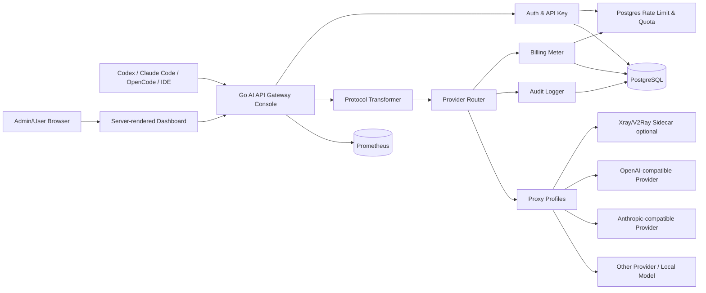
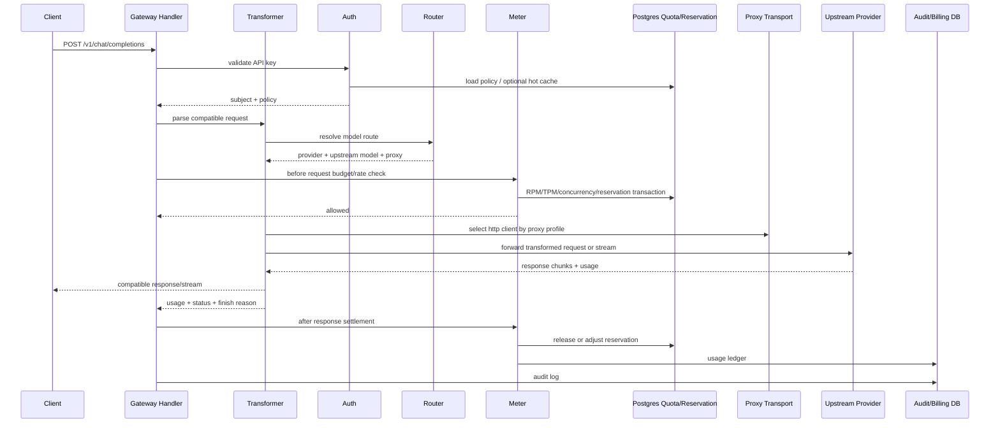

# AI API Gateway Console 组件设计

本文档设计一个面向 Codex、Claude Code、OpenCode、IDE 插件和内部 Agent 的 **AI API Gateway Console**。它提供简单网页、账号体系、兼容 OpenAI/Anthropic/openrouter/deepseek/阿里云 的 API 转发、计费、审计、可视化和可选代理配置。实现语言优先使用 Go，不引入 React/Node 构建链。

管理台目标是用纯 Go 服务端渲染做出接近单页应用的交互感：Go `html/template` 负责页面，HTMX 负责局部刷新、表单提交和列表分页，Tailwind CSS 通过官方 Standalone CLI 生成静态 CSS，不要求 Node.js 参与构建。

## 1. 目标与边界

### 1.1 核心目标

- 提供一个可自部署的管理台，管理员可以配置模型来源、API Key、价格、限流、代理和审计策略。
- 对外暴露 OpenAI-compatible 和 Anthropic-compatible API，方便 Codex、Claude Code、OpenCode 等应用把 base URL 指向 AIYolo。
- 按用户、组织、项目、应用 Key、模型、上游来源统计用量和费用。
- 记录可查询、可导出的审计日志，覆盖登录、配置变更、API 调用、代理选择、失败重试和管理员操作。
- 支持 HTTP、HTTPS、SOCKS5 代理；对 VLESS/Xray/V2Ray 等代理形态采用外部代理进程或 sidecar 暴露本地 HTTP/SOCKS 入站端口，再由 Gateway 选择使用。
- 先做模块化单体，后续再按流量拆出 Gateway、Billing、Audit、Dashboard。

### 1.2 非目标

- 不自行训练模型。
- 不在 Gateway 中实现完整 VLESS/Xray/V2Ray 协议栈，避免把网络代理核心逻辑做成安全负担。
- 不做复杂 BI 平台，MVP 只提供必要的用量、费用、错误率、延迟和审计查询。
- 不引入 React、Next.js、Node.js worker 或前端构建流程。

## 2. 推荐开源组件

| 能力 | 推荐项目 | 用法 |
| --- | --- | --- |
| HTTP 路由 | `github.com/go-chi/chi/v5`，可替换为 Gin/Echo | 当前仓库已引入 chi；业务 Handler 保持 `net/http` 兼容，后续可按团队偏好换 Gin/Echo |
| HTML 页面 | Go `html/template` + HTMX | 服务端渲染；HTMX 做局部刷新、表单提交、分页，形成轻量 SPA 交互感 |
| 表单/样式 | Tailwind CSS Standalone CLI | 编译输出静态 CSS 到 `web/static`，不依赖 Node.js 构建链 |
| 图表 | Chart.js CDN 或 vendored 静态文件 | 用于每日消费曲线、模型分布、错误率和延迟图表 |
| 数据库 | PostgreSQL | 账号、配置、调用记录、计费流水、审计索引 |
| 缓存/限流 | PostgreSQL 优先，Redis 可选 | MVP 使用 PostgreSQL 事务、advisory lock、窗口计数表和预算预留表；出现明确性能瓶颈后再把热点计数迁移到 Redis |
| SQL 访问 | `pgx` + `sqlc` | 类型安全查询，迁移前后稳定 |
| 迁移 | `pressly/goose` | 管理 SQL migration |
| 会话 | `alexedwards/scs` | 管理台 Cookie session |
| 密码 | `golang.org/x/crypto/bcrypt` | 本地账号密码哈希 |
| 权限 | `casbin/casbin` | 管理员、普通用户、审计员、项目成员权限 |
| 限流 | PostgreSQL 事务 + `pg_advisory_xact_lock` | MVP 不引入 Redis；用窗口计数表和预留表承载 RPM/TPM/并发控制 |
| 代理拨号 | Go `net/http` + `x/net/proxy` | HTTP/HTTPS/SOCKS5；Xray/V2Ray 通过本地入站适配 |
| 代理核心 | `net/http/httputil.ReverseProxy` + 自定义 Transformer | 同协议透明转发走 ReverseProxy；跨协议转换、计费和 SSE 解析走专用 Handler |
| Token 估算 | `tiktoken-go/tokenizer` 等 | 上游未返回 usage 时估算成本 |
| 可观测性 | OpenTelemetry + Prometheus + Grafana | trace、metrics、dashboard |
| 日志 | `rs/zerolog` 或 `uber-go/zap` | 结构化日志，关联 request_id |

备注：KrakenD、Traefik、Caddy、Envoy 都是优秀网关/代理项目，但本组件需要理解 LLM 协议、流式响应、token usage、模型价格、审计脱敏和用户级计费。MVP 更适合在 Go 中用 `net/http` 做专用 AI Gateway；以后如果需要通用 L7 能力，可以把 Caddy/Traefik 放在前面做 TLS、域名和基础反代。

## 3. 总体架构



组件以一个二进制启动：

```text
aiyolo-gateway
  - public compatible API: /v1/chat/completions, /v1/responses, /v1/messages ...
  - protocol transformer: OpenAI-compatible, Anthropic-compatible, OpenRouter/DeepSeek/DashScope adapters
  - admin/user console: /console
  - internal admin API: /api/admin/*
  - metrics: /metrics
```

## 4. 兼容接口设计

所有公网兼容接口先进入统一的 Transformer Handler。它负责识别客户端协议、解析请求、归一化内部结构、选择 provider/model route，再把请求转换为目标供应商 JSON。对于上游同样兼容 OpenAI/Anthropic 的路径，可以使用 `httputil.ReverseProxy` 做透明转发；只要涉及协议差异、字段改写、usage 解析或计费审计，就进入专用 adapter。

### 4.1 OpenAI-compatible

面向 Codex、OpenCode 和大量 OpenAI SDK：

```text
GET    /v1/models
POST   /v1/chat/completions
POST   /v1/completions
POST   /v1/embeddings
```

请求头使用标准格式：

```text
Authorization: Bearer aiyolo_xxx
Content-Type: application/json
```

OpenAI-compatible 转发规则与接口规范：

1. 认证 `aiyolo_xxx` API Key，得到用户、组织、项目和预算策略。
2. 读取 `model` 字段，例如 `gpt-4o`、`claude-3-5-sonnet`、`qwen2.5-coder`。
3. 接口规范遵守（面向 Codex / Copilot）：
   - `/v1/chat/completions`: 必须完整支持 `messages`、`tools`、`tool_choice`、`stream`、`stop`、`temperature` 等参数。当 `stream=true` 时，需遵循 OpenAI Server-Sent Events (SSE) 规范，返回 `data: {...}` 直至 `data: [DONE]`。
   - `/v1/completions` (FIM): 针对代码补全中间填充场景（Fill-In-the-Middle），必须支持 `prompt`、`suffix`、`max_tokens` 参数。很多 IDE 补全插件重度依赖此接口。
4. 使用模型路由表找到上游 provider、真实模型名、协议类型、价格和代理配置。
5. 将请求转换为上游格式。若上游也是 OpenAI-compatible，则尽量透明转发。
6. 对流式响应逐块转发，同时记录 usage、延迟、错误和结束原因。
7. 写入 usage ledger 和 audit log。

### 4.2 Anthropic-compatible

面向 Claude Code 和 Anthropic SDK：

```text
GET    /v1/models
POST   /v1/messages
POST   /v1/messages/count_tokens
```

请求头兼容：

```text
x-api-key: aiyolo_xxx
anthropic-version: 2023-06-01
content-type: application/json
```

Anthropic-compatible 转发规则与接口规范：

1. 认证支持：`x-api-key` 和 `Authorization: Bearer` 都可接受，内部统一提取为 API Key。
2. Header 透传与 Beta 特性（面向 Claude Code）：
   - 必须保留并识别 `anthropic-version`。
   - 必须透传上游白名单内的 `anthropic-beta` 头（例如 `prompt-caching-2024-07-31`、`computer-use-2024-10-22`），这是 Claude Code 能够调用 Bash/Tool 和降低 Token 成本的关键。
3. 接口规范遵守：
   - `/v1/messages`: 必须支持 `system` 参数（且需支持包含 `cache_control` 的数组形式）、`messages`（多模态和 tool content）、`tools` 参数。
   - 支持 `stream: true` 的 SSE 透传，必须正确解析 Anthropic 特有的复杂 SSE 事件链路（`message_start` -> `content_block_start` -> `content_block_delta` -> `message_delta` -> `message_stop`）。
4. 对使用量精确计费：
   - 从 `message_start` 提取 `usage.input_tokens` 以及 `usage.cache_creation_input_tokens`、`usage.cache_read_input_tokens`。
   - 从 `message_delta` 提取 `usage.output_tokens`。
   - 缺失时使用估算并标记 `estimated=true`。

### 4.3 应用接入示例

Codex/OpenAI SDK：

```bash
export OPENAI_API_KEY=aiyolo_xxx
export OPENAI_BASE_URL=https://gateway.example.com/v1
```

Claude Code/Anthropic SDK：

```bash
export ANTHROPIC_API_KEY=aiyolo_xxx
export ANTHROPIC_BASE_URL=https://gateway.example.com
```

OpenCode 可配置多个 provider，推荐把 AIYolo 配成 OpenAI-compatible 或 Anthropic-compatible provider，由 AIYolo 内部再路由到真实模型来源。

### 4.4 协议适配层 Transformer

Transformer 的核心职责：

- 解析路径和协议：`/v1/chat/completions`、`/v1/completions` 进入 OpenAI-compatible 解析器，`/v1/messages`、`/v1/messages/count_tokens` 进入 Anthropic-compatible 解析器。
- 统一内部结构：把 message、tool、tool_choice、system prompt、stream、temperature、max_tokens、metadata 等字段归一为内部 `CanonicalRequest`。
- 供应商转换：根据路由结果生成 OpenAI、Anthropic、OpenRouter、DeepSeek、DashScope 或本地模型的上游请求。
- Header 过滤：只透传白名单 header，重新注入上游 master key，避免把用户 API Key 传给供应商。
- 响应转换：把上游响应转换回客户端期望格式，包含错误结构、usage、finish_reason、tool call delta 和 request id。
- 取消传播：客户端断开连接或 context 超时后，立即取消上游请求并记录审计事件。

流式 SSE 是 Transformer 的一等能力，不能只做普通 HTTP body 复制：

- 对 `text/event-stream` 禁用响应缓冲，逐 chunk flush 给 IDE 插件和 Agent。
- 解析 OpenAI `data: {...}`、Anthropic `event: content_block_delta` 等事件，实时累计输出 token 估算和结束状态。
- 在最终 chunk、`finish_reason`、`message_stop` 或上游连接关闭时完成结算。
- 上游返回最终 `usage` 时以真实 usage 为准；缺失时使用 tokenizer 估算，并标记 `estimated=true`。
- 已经开始向客户端输出的流式请求不跨 provider 自动重试，只记录上游错误和半完成状态。

## 5. 管理台页面

管理台全部由 Go 服务端渲染，页面结构：

```text
/console/login
/console
/console/usage
/console/audit
/console/api-keys
/console/providers
/console/models
/console/proxies
/console/billing
/console/users
/console/settings
```

### 5.1 页面职责

| 页面 | 功能 |
| --- | --- |
| 首页 | 今日调用量、费用、错误率、P95 延迟、最近异常 |
| Usage | 按时间、用户、API Key、模型、provider、代理查看用量和费用 |
| Audit | 查询 API 调用、登录、配置变更、失败重试、预算拦截 |
| API Keys | 创建、禁用、轮换、绑定预算和权限 |
| Providers | 配置 OpenAI、Anthropic、本地模型、第三方中转源 |
| Models | 模型别名、真实模型、价格、上下文长度、协议类型 |
| Proxies | 配置代理 profile，测试连通性，查看失败率 |
| Billing | 价格表、充值/额度、账单导出、预算告警 |
| Users | 用户、组织、角色、状态 |
| Settings | 全局策略、审计保留、默认超时、默认代理 |

### 5.2 可视化指标

MVP 仪表盘至少提供下列图表和指标。图表可以先用 Chart.js CDN 引入，生产环境再 vendored 到静态目录，避免运行时依赖外部网络。

- 请求数、成功率、错误率、超时率。
- token 输入/输出、总 token、估算 token 占比。
- 按模型、provider、用户、API Key 的费用排名。
- P50/P95/P99 延迟。
- 代理 profile 的成功率、平均延迟和最近错误。
- 预算拦截次数、限流次数、认证失败次数。

## 6. 账号、权限与 API Key

### 6.1 账号模型

支持本地账号优先，后续再接 OAuth/OIDC：

- `owner`：系统所有者，拥有所有配置权限。
- `admin`：管理 provider、模型、代理、用户和账单。
- `developer`：创建自己的 API Key，查看自己的用量。
- `auditor`：只读审计和用量报表。

### 6.2 API Key 设计

API Key 使用一次性明文展示，数据库只保存哈希：

```text
aiyolo_live_xxxxxxxxxxxxxxxxxxxxx
aiyolo_test_xxxxxxxxxxxxxxxxxxxxx
```

Key 属性：

- 所属用户、组织、项目。
- 允许的协议：OpenAI-compatible、Anthropic-compatible。
- 允许的模型/模型组。
- RPM/TPM/并发限制。
- 日预算、月预算、总预算。
- 过期时间和状态。
- 默认路由策略和默认代理策略。

用户自制令牌只映射到 AIYolo 内部身份、预算和路由策略，不直接映射到某个供应商 master key。真正的上游系统令牌保存在 provider secret 中，由 Transformer 在转发时重新注入。这样用户侧可以自由轮换自己的 API Key，而不会看到或复制系统级供应商密钥。

## 7. Provider、模型与路由

### 7.1 Provider 来源

Provider 是真实上游接口来源：

| 类型 | 示例 | 协议 |
| --- | --- | --- |
| OpenAI | OpenAI、Azure OpenAI、OpenAI-compatible 中转 | OpenAI-compatible |
| Anthropic | Anthropic、Claude-compatible 中转 | Anthropic-compatible |
| DeepSeek | DeepSeek 官方 API 或兼容中转 | OpenAI-compatible |
| DashScope | 阿里云 DashScope/Qwen | OpenAI-compatible 或 DashScope adapter |
| Local | Ollama、vLLM、LocalAI、llama.cpp server | OpenAI-compatible |
| Custom | 企业内部模型网关 | OpenAI/Anthropic/custom adapter |

### 7.2 模型别名

对外暴露稳定别名，对内映射真实模型：

```text
public model: claude-sonnet
provider: anthropic-main
upstream model: claude-sonnet-4-5-20250929
protocol: anthropic
proxy: proxy-hk-socks5
price: pricing.claude-sonnet
```

Codex、Claude Code、OpenCode 等客户端只看见 `public model`，管理员可以在不改客户端配置的情况下切换真实上游。

### 7.3 路由策略

MVP 支持三种路由：

1. **固定路由**：模型别名固定到一个 provider。
2. **优先级路由**：按 priority 尝试 provider，失败后切换。
3. **权重路由**：按权重分流，用于灰度和成本优化。

路由必须受预算、权限、模型可用状态和代理状态约束。失败重试只允许在幂等或可安全重试的阶段进行；对于已开始输出的流式响应，不做自动切换，只记录失败并结束。

### 7.4 渠道管理

渠道是 provider 的可运营实例，用来承载 base URL、master key、协议类型、代理 profile、健康状态和调度权重。一个供应商可以配置多个渠道，例如 `deepseek-main`、`deepseek-backup`、`dashscope-cn`、`openai-hk-proxy`。

渠道字段至少包含：

- `base_url`：上游 API 根地址。
- `protocol`：`openai`、`anthropic`、`dashscope`、`custom`。
- `master_key_secret_ref`：上游系统令牌引用，只允许服务端解密。
- `proxy_profile_id`：可为空，为空时走 provider 或系统默认代理。
- `priority`、`weight`：用于优先级路由和权重分流。
- `status`、`last_health_check`、`last_error`：用于调度和管理台展示。
- `rate_limit_hint`：供应商侧 RPM/TPM 配额，用于避免把请求打爆上游。

## 8. 代理配置设计

### 8.1 Proxy Profile

管理员先创建代理 profile，每个 provider 或模型路由可以选择其中一个：

| 字段 | 说明 |
| --- | --- |
| `name` | 例如 `direct`、`hk-socks5-1`、`xray-sg` |
| `type` | `direct`、`http`、`https`、`socks5`、`xray`、`v2ray` |
| `endpoint` | HTTP/SOCKS 地址，或本地 Xray/V2Ray 入站地址 |
| `auth` | 用户名/密码或引用 secret |
| `region` | 逻辑地区，例如 `cn`、`hk`、`sg`、`jp`、`us` |
| `timeout` | 连接超时和整体超时 |
| `health_check_url` | 连通性检测目标 |
| `status` | enabled/disabled/degraded |

### 8.2 HTTP/HTTPS/SOCKS5

Go Gateway 直接支持：

- HTTP/HTTPS proxy：使用 `http.Transport.Proxy`。
- SOCKS5 proxy：使用 `golang.org/x/net/proxy` 创建 dialer，再注入 `http.Transport.DialContext`。

每个上游 provider 拥有独立 `http.Client` 池，池 key 至少包含：

```text
provider_id + proxy_profile_id + tls_settings + timeout_policy
```

配置文件和数据库都允许为不同 provider 单独指定代理，例如 OpenAI 走 `hk-socks5-1`，DashScope 走 `direct`，Anthropic 走 `sg-http-1`。运行时解析顺序仍以请求路由、provider、项目/API Key、系统默认逐层回退。

### 8.3 VLESS/Xray/V2Ray

不在业务进程内实现 VLESS/Xray/V2Ray 协议。推荐的简化方案是：

**独立部署**：管理员在服务器上独立部署 Xray/V2Ray，把本地 `127.0.0.1:1080` 暴露为 SOCKS5 或 `127.0.0.1:8080` 暴露为 HTTP proxy；Gateway 的 proxy profile 选择 `socks5` 或 `http`。

这样可以把复杂代理协议、安全更新和网络规避能力交给成熟项目，Gateway 保持其轻量性，只负责选择代理、健康检查、审计和故障隔离。

### 8.4 代理选择优先级

一次请求的代理按以下顺序解析：

1. 模型路由指定的 proxy profile。
2. Provider 指定的 proxy profile。
3. API Key 或项目策略指定的默认 proxy profile。
4. 系统默认 proxy profile。
5. `direct`。

审计日志必须记录最终使用的 proxy profile id/name，但不能记录代理密码、token、VLESS UUID 等敏感字段。

## 9. 计费与预算

### 9.1 Usage 采集

优先使用上游返回的 usage：

- OpenAI-compatible：`usage.prompt_tokens`、`usage.completion_tokens`、`usage.total_tokens`。
- Anthropic-compatible：`usage.input_tokens`、`usage.output_tokens`。
- 流式响应：优先解析最终 usage chunk；没有最终 usage 时做估算。

如果上游没有 usage，则 Gateway 使用 tokenizer 估算，并把 `usage_estimated=true` 写入流水，方便后续校准。

### 9.2 价格表

价格表按模型和时间版本化：

```text
model_alias
provider_id
currency
input_price_per_1m_tokens
output_price_per_1m_tokens
cache_read_price_per_1m_tokens
cache_write_price_per_1m_tokens
effective_from
effective_to
```

每次调用在结束时生成不可变 usage ledger：

```text
request_id
user_id
api_key_id
provider_id
model_alias
upstream_model
input_tokens
output_tokens
total_tokens
cost_amount
currency
estimated
created_at
```

### 9.3 预算控制

预算检查分为请求前和请求后：

- 请求前预估：检查账号状态、API Key 状态、模型权限、余额、日/月预算、RPM/TPM/并发；根据输入和 `max_tokens` 估算最坏成本，必要时做预算预留。
- 请求后结算：流式传输结束后解析最终 `usage` 或估算 usage，按真实用量扣费，释放或补扣预留额度。
- 异常收尾：上游中断、客户端断开、超时或没有最终 usage 时，按已观测 token 和请求上下文估算，写入 `estimated=true` 和错误状态。

为了避免并发超花，MVP 对关键预算和限流使用 PostgreSQL 事务、窗口计数表、预留表和 advisory lock。只有当这部分出现明确性能瓶颈时，再考虑把热点计数迁移到 Redis。

### 9.4 PostgreSQL 限流与预留

PostgreSQL 是 MVP 的限流、预算和预留一致性边界，Redis 只作为后续性能瓶颈出现后的优化选项。

PostgreSQL 侧先承载这些短周期状态：

- API Key 状态、权限、RPM/TPM/并发限制和预算策略直接从 PostgreSQL 读取。
- `rate_limit_windows` 记录 API Key 维度的分钟级请求数和 token 预留量。
- `quota_reservations` 记录请求前预算预留、并发占用、预估 token、最终 token 和结算状态。
- 预留和结算使用事务与 `pg_advisory_xact_lock` 按 API Key 串行化，避免并发超花。
- 请求结束后以真实 usage 修正窗口 token 数，并将最终结果写入不可变 `usage_ledger`。

如果未来高频请求让 PostgreSQL 计数表成为瓶颈，再将 API Key 热缓存、窗口计数和短期熔断迁移到 Redis；最终账本、审计和预算结算仍以 PostgreSQL 为准。

## 10. 审计与安全

### 10.1 审计事件

必须记录：

- 登录、登出、登录失败。
- 创建/禁用/轮换 API Key。
- 创建/修改/删除 provider、model、proxy、price。
- 每次 API 调用的 metadata。
- 预算拦截、限流、认证失败。
- 上游错误、代理错误、重试、熔断。
- 管理员导出审计/账单。

### 10.2 API 调用审计字段

```text
request_id
trace_id
user_id
api_key_id
client_ip
user_agent
protocol
endpoint
model_alias
provider_id
upstream_model
proxy_profile_id
status_code
error_code
latency_ms
input_tokens
output_tokens
cost_amount
stream
created_at
```

默认不保存完整 prompt/response 正文。若企业需要内容审计，应开启独立策略：

- 明确标记为敏感能力。
- 支持按组织/项目/API Key 开关。
- 入库前脱敏。
- 加密存储。
- 设置保留期。
- 所有查看正文的行为再次写审计。

管理台的 Audit 页面采用瀑布流或时间线视图展示请求记录。点击单条 request 可以查看路由、代理、usage、费用、上游错误、SSE 结束事件和重试信息；若内容审计策略启用，再提供加密 prompt/response 正文查看入口。

## 11. 数据模型草案

核心表：

```text
users
organizations
organization_members
sessions
api_keys
providers
provider_secrets
models
model_routes
proxy_profiles
pricing_rules
usage_ledger
quota_reservations
audit_logs
encrypted_payloads
rate_limit_events
budget_policies
```

关键关系：

- `api_keys.user_id -> users.id`
- `models.public_name -> model_routes.model_public_name`
- `model_routes.provider_id -> providers.id`
- `model_routes.proxy_profile_id -> proxy_profiles.id`
- `usage_ledger.request_id -> audit_logs.request_id`

secret 字段不直接明文入库。MVP 可使用环境变量主密钥做 envelope encryption；生产应接 Vault、SOPS、KMS 或 Kubernetes Secret。

## 12. Go 代码结构建议

```text
aiyolo/
  cmd/
    gateway/
      main.go
  internal/
    app/
      server.go
      config.go
    auth/
      password.go
      session.go
      apikey.go
      middleware.go
    console/
      handlers.go
      templates/
      static/
    transformer/
      canonical.go
      handler.go
      reverse_proxy.go
      sse.go
      errors.go
    gateway/
      openai_handlers.go
      anthropic_handlers.go
    providers/
      router.go
      adapter.go
      openai.go
      anthropic.go
      dashscope.go
      deepseek.go
      local_openai.go
    proxy/
      profile.go
      transport_factory.go
      healthcheck.go
    ratelimit/
      postgres_limiter.go
      quota_reservation.go
    billing/
      meter.go
      pricing.go
      budget.go
      ledger.go
    audit/
      logger.go
      redaction.go
    db/
      queries/
      migrations/
    observability/
      metrics.go
      tracing.go
```

主要接口：

```go
type ProviderAdapter interface {
    ListModels(ctx context.Context, route Route) ([]ModelInfo, error)
    ChatCompletions(ctx context.Context, req OpenAIChatRequest, route Route) (*UpstreamResponse, error)
    Completions(ctx context.Context, req OpenAICompletionsRequest, route Route) (*UpstreamResponse, error)
    Messages(ctx context.Context, req AnthropicMessagesRequest, route Route) (*UpstreamResponse, error)
}

type TransportFactory interface {
    HTTPClient(ctx context.Context, provider Provider, proxy ProxyProfile) (*http.Client, error)
}

type ProtocolTransformer interface {
    Parse(ctx context.Context, r *http.Request) (*CanonicalRequest, error)
    BuildUpstream(ctx context.Context, req *CanonicalRequest, route Route) (*http.Request, error)
    Stream(ctx context.Context, w http.ResponseWriter, upstream *http.Response, route Route) (*UsageRecord, error)
}

type Meter interface {
    BeforeRequest(ctx context.Context, req MeterRequest) error
    AfterResponse(ctx context.Context, usage UsageRecord) error
}
```

## 13. 请求处理流程



## 14. MVP 实施顺序

1. 建立 Go 服务骨架：chi、配置、Postgres、migration、结构化日志、`html/template`、HTMX、Tailwind Standalone CLI。
2. 实现本地账号登录、session、角色和 API Key。
3. 实现 provider/model/proxy 的 CRUD 管理台。
4. 实现 Transformer 内部结构和 OpenAI-compatible `/v1/models`、`/v1/chat/completions`。
5. 实现 Anthropic-compatible `/v1/messages` 和 SSE 事件转换。
6. 实现 HTTP/HTTPS/SOCKS5 proxy profile 和上游连通性测试。
7. 实现 usage 采集、价格表、usage ledger、PostgreSQL 限流和双阶段预算预留/结算。
8. 实现 audit log 中间件和查询页面。
9. 实现 usage/dashboard 可视化，使用 Chart.js 展示每日消费曲线和模型分布。
10. 增加高级代理方案（如独立部署 Xray 配合 profile）的配置文档。
11. 增加 OpenTelemetry、Prometheus metrics 和健康检查。

## 15. 第一版验收标准

- 管理员可以登录网页，创建 provider、模型别名、价格和 proxy profile。
- 管理员可以创建 DeepSeek、DashScope、OpenAI-compatible、Anthropic-compatible 等渠道，配置 base URL、master key、协议、权重和代理。
- 每个 provider 或模型路由可以选择不同代理，`direct`、HTTP proxy、SOCKS5 proxy 至少可用。
- Codex/OpenAI SDK 能通过 AIYolo 调用 `/v1/chat/completions`。
- Claude Code/Anthropic SDK 能通过 AIYolo 调用 `/v1/messages`。
- OpenAI/Anthropic 流式 SSE 能逐 chunk 返回，不被服务端缓冲，并能在结束后完成 usage 结算。
- 每次调用都能生成 request_id，并在审计页查询到 provider、模型、API Key、代理、耗时、状态和费用。
- Dashboard 能展示最近 24 小时调用量、费用、错误率和延迟。
- API Key 可禁用、限流、限预算；PostgreSQL 中的 `rate_limit_windows`、`quota_reservations` 和 `usage_ledger` 对账一致。
- 敏感配置不明文展示，审计日志不泄露上游 API Key、代理密码或 VLESS UUID。

## 16. 开源项目参考与复用边界

这些项目可以作为实现参考，其中 New API 作为首要后端参考源；但 AIYolo 的管理台仍保持 Go 服务端渲染、HTMX 和 Tailwind Standalone CLI 路线。

| 项目 | 匹配度 | 可借鉴内容 | 注意事项 |
| --- | --- | --- | --- |
| One API | 90% | 多供应商接入、模型路由、计费、账号、代理配置、渠道管理，尤其是 relay/controller 相关后端逻辑 | 前端是 React，不直接复用 UI；参考后端流程和数据模型即可 |
| New API | 95% | 作为首要后端参考源，重点参考协议转换、流式 SSE 处理、计费优化、多渠道调度、失败处理和国产模型兼容 | 仓库形态是完整应用而非稳定 SDK，且采用 AGPLv3；默认不把它的 module/pkg 作为直接依赖，而是在 AIYolo 内部按边界重写或移植 |
| Go-Proxy-OpenAI | 60% | 极简 Go 代理、OpenAI-compatible 请求转发、ReverseProxy 起步方式 | 功能少，缺账号、审计、计费、限流和多协议转换，只适合作为最小代理样例 |

### 16.1 按 New API 后端结构拆解的 AIYolo 模块映射表

New API 的后端目录更接近“完整应用分层”，其中 `controller`、`service`、`model`、`relay` 之间存在较多纵向耦合。AIYolo 不建议做一套同名目录照搬，而是把这些职责重新落到自己的入口层、转换层、路由层、计费层和控制台层。

| New API 后端层 | New API 典型职责 | AIYolo 对应模块 | AIYolo 第一版落地方式 |
| --- | --- | --- | --- |
| `router` | 组装路由，区分控制台页面、管理 API、relay API 和中间件顺序 | `cmd/gateway/main.go` + `internal/app/server.go` + `internal/gateway` + `internal/console` | 只保留启动与装配职责，不把认证、计费、协议判断塞进路由注册层 |
| `middleware` | 认证、request id、日志、限流、分发、gzip、CORS、统计 | `internal/auth/middleware.go` + `internal/ratelimit` + `internal/audit` + `internal/observability` + `internal/app/server.go` | 按横切关注点拆分，避免出现一个巨大的 `middleware` 包 |
| `controller/channel`、`controller/model`、`controller/token`、`controller/billing` | 管理台 CRUD、管理 API、表单提交、配置变更 | `internal/console/handlers.go` + `internal/db/queries` + `internal/providers` + `internal/billing` + `internal/proxy` | Handler 只做参数绑定、权限检查和响应组装，业务逻辑下沉到领域模块 |
| `controller/log`、`controller/usedata`、`controller/rankings` | 审计查询、用量统计、排行榜、Dashboard 数据聚合 | `internal/console/handlers.go` + `internal/audit` + `internal/billing/ledger.go` + `internal/db/queries` | 报表类查询直接围绕 ledger 和 audit 做 SQL 聚合，不把统计逻辑塞回 gateway handler |
| `relay/*_handler` | Chat Completions、Responses、Claude、Gemini、Embeddings 等协议入口 | `internal/gateway/openai_handlers.go` + `internal/gateway/anthropic_handlers.go` + `internal/transformer/handler.go` | 按“客户端兼容协议”拆入口，不按上游厂商拆入口 |
| `relay/common_handler`、`relay/compatible_handler`、`service/convert` | 统一 CanonicalRequest、字段改写、SSE 事件转换、错误格式回写 | `internal/transformer/canonical.go` + `internal/transformer/sse.go` + `internal/transformer/errors.go` | 这是 AIYolo 最该重点吸收 New API 经验的核心层 |
| `relay/channel`、`service/channel_select`、`service/channel_affinity` | 渠道路由、权重选择、失败重试、模型映射、亲和性策略 | `internal/providers/router.go` + `internal/providers/adapter.go` + `internal/proxy/profile.go` | 把“选哪条路”与“怎么转协议”分开，后续更容易单独拆 Gateway/Router |
| `service/pre_consume_quota`、`service/billing`、`service/billing_session`、`service/tiered_settle` | 预算预留、事后结算、价格计算、阶梯计费、缓存命中计费 | `internal/billing/meter.go` + `internal/billing/pricing.go` + `internal/billing/budget.go` + `internal/ratelimit/quota_reservation.go` | 第一版先做双阶段预留/结算，再逐步补复杂阶梯价和命中价 |
| `service/tokenizer`、`service/token_estimator`、`service/text_quota` | token 估算、usage 补全、模型计价单位换算 | `internal/billing/pricing.go` + `internal/billing/meter.go` + `internal/transformer/canonical.go` | 估算逻辑放到计费边界，不放进 provider adapter 里 |
| `model/channel`、`model/pricing`、`model/token`、`model/log`、`model/user` | 渠道、价格、API Key、日志、用户等持久化模型 | `internal/db/queries` + `internal/auth/apikey.go` + `internal/billing/ledger.go` + `internal/providers/router.go` | 不复制一个全局 `model` 包，而是按 auth、providers、billing、audit 分别持有自己的仓储入口 |
| `dto`、`types` | OpenAI/Claude/Gemini 请求响应 DTO、统一错误、请求元数据 | `internal/transformer/canonical.go` + `internal/transformer/errors.go` + `internal/gateway` 内局部协议结构 | DTO 只留在边界层流转，不进入 auth、billing、db 领域对象 |
| `common`、`constant`、`setting` | 环境变量、全局常量、默认值、运行期开关、通用 HTTP/缓存工具 | `internal/app/config.go` + `internal/observability` + `internal/proxy/transport_factory.go` + `internal/app/server.go` | 配置集中收敛到 app 层，避免形成跨包共享的隐式全局状态 |

按这张表落地时，AIYolo 实际上是在把 New API 的纵向应用目录，重组为更适合后续拆服务的横向能力边界：`gateway + transformer` 负责协议入口，`providers + proxy` 负责路由和上游访问，`billing + ratelimit + audit` 负责计量闭环，`console + db` 负责管理面。

参考策略：

1. 实现时优先对照 New API 的协议转换、流式处理、渠道调度、失败重试、额度结算和模型兼容逻辑，先吸收后端链路经验，再落到 AIYolo 的本地包结构。
2. 不把 `github.com/QuantumNous/new-api` 作为运行时直接依赖；它更像完整网关应用而不是稳定库，和 Gin、GORM、全局配置、数据模型以及现成管理台耦合较深。
3. 若只是参考实现思路，则按 AIYolo 的 `internal/transformer`、`internal/providers`、`internal/billing`、`internal/auth` 边界自行实现；若直接复制或改写其源码，需单独评估 AGPLv3 及附加署名/原项目链接义务。
4. AIYolo 自己实现账号、审计、HTMX 管理台、加密 secret、PostgreSQL 限流和部署约束，避免被外部项目的前端栈和应用级全局状态绑定。
5. 对于透明 OpenAI-compatible 转发，可参考 Go-Proxy-OpenAI 的最小链路，再逐步并入来自 New API 的渠道重试、usage 统计和多协议适配经验。
