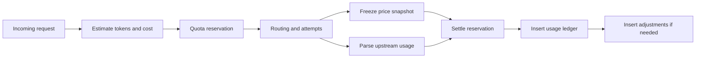

# AIYolo Gateway Billing Ledger 设计

本文档细化 AIYolo 的用量账本、价格快照、BYOK 成本、缓存成本和退款规则。目标是在当前已经可用的 `usage_ledger`、`quota_reservations`、`pricing_rules` 基础上，演进到可解释、可回放、可导出、可支持多 Provider 路由的计费体系。

相关文档：

- [docs/api-gateway-console-design.md](./api-gateway-console-design.md)
- [docs/openrouter-feature-inventory.md](./openrouter-feature-inventory.md)
- [docs/gateway-routing-design.md](./gateway-routing-design.md)

当前代码基线：

- 请求配额预留与结算在 [internal/storage/postgres.go](../internal/storage/postgres.go)
- 当前成本计算在 [internal/gateway/handlers.go](../internal/gateway/handlers.go)
- 领域模型在 [internal/domain/types.go](../internal/domain/types.go)
- 初始表结构在 [internal/storage/migrations/000001_init.up.sql](../internal/storage/migrations/000001_init.up.sql)
- 价格规则表在 [internal/storage/migrations/000003_pricing_rules.up.sql](../internal/storage/migrations/000003_pricing_rules.up.sql)

## 1. 目标与原则

### 1.1 目标

- 对每一次 generation 给出可解释的 token、成本、价格来源和调整记录。
- 支持多次 attempt、跨模型 fallback、prompt cache、response cache、BYOK 和退款。
- 把“预算预留”和“最终结算”拆开，避免只记录最终结果导致超卖或误封。
- 为控制台 Usage、Audit、Logs、Exports、Billing 页面提供统一事实来源。
- 为以后接入 OpenRouter usage 细项、Anthropic prompt cache、图片/音频/web search 计费预留字段。

### 1.2 设计原则

- 价格以快照结算，不依赖“事后再查当前价格”。
- 事实表可追加，不就地覆盖历史结算原因。
- 同一请求的成本要能拆成“上游推断成本”、“网关对客户记账成本”、“退款/保险调整”。
- 预算校验以最保守的预估进行，最终再按真实 usage 和退款规则结算。

## 2. 当前实现基线

当前链路已经具备计费闭环的最小版本：

1. 网关读请求体，估算输入 token 与 `max_tokens`。
2. 根据 `pricing_rules` 估算本次请求成本。
3. 在 `quota_reservations` 中写入一条预留记录。
4. 请求返回后，从 JSON 或 SSE 中解析 usage。
5. 用真实 usage 重新计算成本，并写入 `usage_ledger`。
6. `SettleQuota` 用真实 token 修正窗口计数，把预留状态改为 `settled` 或 `failed`。

这一版已经做对了两件关键事情：

- 预算不是只看最终账本，而是把未完成请求的预留金额也算进去。
- 流式与非流式请求最终都能落到统一 `UsageRecord`。

当前不足：

- `usage_ledger` 只有最终结果，没有 generation 和 attempt 事实。
- 成本来自当前 `pricing_rules`，没有价格快照，难以审计历史差异。
- 没有 `is_byok`、`upstream_inference_cost`、`gateway_markup` 等字段。
- 没有 adjustment/refund 账本，无法解释 zero completion insurance 或人工补偿。
- response cache 和 prompt cache 的命中、写入成本没有独立事实表。

## 3. 核心概念

| 概念 | 含义 |
| --- | --- |
| `generation` | 客户端发起的一次完整调用。 |
| `attempt` | generation 内针对某个 candidate 的一次真实上游尝试。 |
| `quota reservation` | 预算和令牌的预留占位。 |
| `usage ledger` | 面向报表和账单的最终记账事实。 |
| `price snapshot` | 结算时冻结的单价集合。 |
| `adjustment` | 对既有 ledger 做的补差、退款或保险冲销。 |
| `settlement` | 从预留到最终记账的完成过程。 |

## 4. 目标数据模型

### 4.1 继续保留的现有表

- `quota_reservations`
- `usage_ledger`
- `pricing_rules`
- `audit_logs`

### 4.2 新增表

#### `generations`

表示一次外部请求的主记录。

建议字段：

| 字段 | 说明 |
| --- | --- |
| `id` | generation id。 |
| `request_id` | 外部请求 id。 |
| `workspace_id` | 工作区。 |
| `api_key_id` | 发起方 key。 |
| `user_id` | 归属用户。 |
| `public_model` | 客户端请求模型。 |
| `protocol` | openai、anthropic。 |
| `endpoint` | `/v1/chat/completions` 等入口。 |
| `stream` | 是否流式。 |
| `requested_service_tier` | 请求级 tier。 |
| `route_strategy` | 选路策略名。 |
| `status` | running、succeeded、failed、cancelled。 |
| `final_attempt_index` | 成功或结束时的 attempt 序号。 |
| `started_at` | 开始时间。 |
| `finished_at` | 完成时间。 |

#### `generation_attempts`

与路由文档中的 `routing_attempts` 保持一致，作为计费维度最细的调用事实。

额外建议字段：

| 字段 | 说明 |
| --- | --- |
| `price_snapshot_id` | 本次尝试绑定的价格快照。 |
| `is_byok` | 是否使用 BYOK 凭据。 |
| `byok_credential_id` | 使用的 BYOK key。 |
| `input_tokens` | 真实输入 token。 |
| `output_tokens` | 真实输出 token。 |
| `cache_read_tokens` | prompt cache 读。 |
| `cache_write_tokens` | prompt cache 写。 |
| `reasoning_tokens` | reasoning token。 |
| `request_charge_units` | 按次收费单元。 |
| `upstream_cost_micro_cents` | 上游实际或估算成本。 |
| `billable_cost_micro_cents` | 对客户记账成本。 |

#### `price_snapshots`

冻结结算单价，避免历史回放受当前价格影响。

建议字段：

| 字段 | 说明 |
| --- | --- |
| `id` | snapshot id。 |
| `source_type` | shared_pricing、byok_override、manual_override。 |
| `source_ref` | 对应 `pricing_rules.id` 或凭据 id。 |
| `provider_id` | 供应商。 |
| `provider_endpoint_id` | endpoint。 |
| `public_model` | 对外模型。 |
| `upstream_model` | 实际模型。 |
| `currency` | 货币。 |
| `input_price_per_million_tokens` | 输入单价。 |
| `output_price_per_million_tokens` | 输出单价。 |
| `cache_read_price_per_million_tokens` | cache read 单价。 |
| `cache_write_price_per_million_tokens` | cache write 单价。 |
| `reasoning_price_per_million_tokens` | reasoning 单价。 |
| `request_price_micro_cents` | 按次收费。 |
| `image_price_micro_cents` | 图片单价。 |
| `web_search_price_micro_cents` | server tool 单价。 |
| `gateway_markup_ratio_bps` | 网关加价比例。 |
| `created_at` | 创建时间。 |

#### `billing_adjustments`

记录退款、保险和手工补差。

建议字段：

| 字段 | 说明 |
| --- | --- |
| `id` | adjustment id。 |
| `generation_id` | 关联 generation。 |
| `request_id` | 请求 id。 |
| `usage_request_id` | 对应 usage ledger 行。 |
| `type` | refund、insurance、manual_credit、manual_debit。 |
| `reason_code` | zero_completion、provider_outage、duplicate_charge 等。 |
| `amount_micro_cents` | 正数表示加收，负数表示退款。 |
| `currency` | 货币。 |
| `details` | 附加元数据。 |
| `created_by` | system 或 admin id。 |
| `created_at` | 创建时间。 |

#### `prompt_cache_observations`

记录 prompt cache 命中和写入事实，支持 sticky routing 优化。

建议字段：

| 字段 | 说明 |
| --- | --- |
| `id` | observation id。 |
| `generation_id` | 关联 generation。 |
| `provider_id` | 供应商。 |
| `provider_endpoint_id` | endpoint。 |
| `cache_scope_key` | 归一化 cache scope。 |
| `cache_key_hash` | hash。 |
| `cache_read_tokens` | 命中 token。 |
| `cache_write_tokens` | 写入 token。 |
| `ttl_seconds` | ttl。 |
| `created_at` | 观察时间。 |

## 5. 账务生命周期

### 5.1 预留阶段

预留发生在真正调用上游之前，输入为：

- 估算输入 token
- 估算输出 token 上限
- 预估成本
- API Key 的 RPM、TPM、并发、日预算、月预算

预留阶段目标：

- 拒绝明显超限请求。
- 保护共享余额不被并发请求瞬间透支。
- 为后续调整留出差值空间。

### 5.2 价格快照阶段

在第一条 attempt 发出前必须冻结快照，而不是成功后再查价格。原因：

- 价格可能在请求执行期间变化。
- fallback 到不同 endpoint 时，每次 attempt 价格可能不同。
- BYOK 与 shared capacity 的单价来源不同。

规则：

- 每个 attempt 绑定一个 `price_snapshot_id`。
- generation 最终账单默认采用成功 attempt 的快照。
- 若所有 attempt 都失败，但已产生计费上游成本，仍按失败 attempt 快照记账或做 adjustment。

### 5.3 结算阶段

结算顺序：

1. 汇总最终 usage 细项。
2. 根据成功 attempt 的价格快照计算 billable cost。
3. 将 `quota_reservations` 改为 `settled` 或 `failed`。
4. 写入 `usage_ledger`。
5. 如果满足保险或退款规则，再写入 `billing_adjustments`。

## 6. 成本组成

一次最终账单由以下部分组成：

- 输入 token 成本
- 输出 token 成本
- prompt cache read 成本
- prompt cache write 成本
- reasoning token 成本
- request 级固定收费
- 图片、音频、web search 等工具成本
- 网关加价或折扣
- adjustment 产生的补差

可采用统一公式：

`billable_cost = token_cost + request_cost + tool_cost + gateway_markup + adjustment_total`

其中：

- `token_cost = input + output + cache_read + cache_write + reasoning`
- `gateway_markup` 可以是固定值，也可以是基于上游成本的百分比。
- `adjustment_total` 默认为 0，退款时为负值。

## 7. `usage_ledger` 演进方案

### 7.1 当前字段

当前 `usage_ledger` 已包含：

- `request_id`
- `user_id`
- `api_key_id`
- `provider_id`
- `model_alias`
- `upstream_model`
- `protocol`
- `endpoint`
- `input_tokens`
- `output_tokens`
- `cache_read_tokens`
- `cache_creation_tokens`
- `total_tokens`
- `cost_micro_cents`
- `currency`
- `estimated`
- `stream`
- `status_code`
- `latency_ms`
- `created_at`

### 7.2 建议新增字段

| 字段 | 说明 |
| --- | --- |
| `generation_id` | generation 关联。 |
| `final_attempt_id` | 成功或最终 attempt。 |
| `price_snapshot_id` | 结算快照。 |
| `workspace_id` | 工作区。 |
| `route_strategy` | 路由策略。 |
| `reasoning_tokens` | reasoning 使用量。 |
| `request_charge_units` | 按次收费数量。 |
| `image_units` | 图片生成数量。 |
| `web_search_requests` | server tool 调用数。 |
| `is_byok` | 是否 BYOK。 |
| `upstream_cost_micro_cents` | 上游成本。 |
| `gateway_markup_micro_cents` | 网关加价。 |
| `adjusted_cost_micro_cents` | adjustment 合并后的净额。 |
| `cache_status` | miss、hit、write_only。 |
| `refund_status` | none、partial、full。 |

### 7.3 表定位

`usage_ledger` 只保留“最终对客户记账”的一行事实，不去承载完整 attempt 历史。attempt 级别明细放到 `generation_attempts`，调整类明细放到 `billing_adjustments`。

## 8. 价格快照来源

### 8.1 Shared capacity

默认从 `pricing_rules` 读取，生成 snapshot 时冻结：

- `provider_id`
- `public_model`
- `upstream_model`
- 有效时间段内的 token 单价

### 8.2 BYOK

BYOK 至少区分三种值：

| 字段 | 含义 |
| --- | --- |
| `is_byok` | 这次调用是否使用客户自带凭据。 |
| `upstream_inference_cost_micro_cents` | 上游估算或回传成本。 |
| `billable_cost_micro_cents` | AIYolo 对客户最终记账金额。 |

BYOK 常见计费模式：

1. 纯 passthrough：对客户记 0，仅计入运营观测。
2. 平台费：按请求或按 token 加固定平台费。
3. 限额内计入：虽然推理成本由客户承担，但仍占用网关预算。

因此 API Key 和 Workspace 需要额外控制项：

- `include_byok_in_limit`
- `byok_markup_mode`
- `byok_markup_value`

## 9. 缓存成本

### 9.1 Response cache

response cache 是平台层缓存，与上游 prompt cache 分离。

规则建议：

- cache hit 时，`usage_ledger.cost_micro_cents = 0`。
- 仍写 ledger，但 `cache_status = hit`，方便统计命中率。
- cache hit 不写新的 `generation_attempts` 上游记录，但可以写一条 `generation_attempts` 标记为 `cache_hit`。

### 9.2 Prompt cache

prompt cache 成本来自上游，不能与 response cache 混为一谈。

规则建议：

- `cache_read_tokens` 和 `cache_write_tokens` 分开计价。
- 与普通输入 token 分别展示。
- 即使上游没有单独返回费用，也要保留 token 量，便于后续回算。

## 10. 退款与保险规则

### 10.1 Zero completion insurance

建议系统规则：

- 若上游返回成功状态，但 `completion_tokens = 0`，且 `finish_reason` 为空或错误态，则对输出侧费用做全额冲销。
- 如果没有产生任何 billable output，可整单退款。

### 10.2 Provider outage refund

若请求在多次 retry 后最终失败，且前序 attempt 已被计费：

- shared capacity 模式下由系统写入退款 adjustment。
- BYOK 模式下默认只记录 `upstream_cost_micro_cents`，是否退款取决于平台费策略。

### 10.3 人工调整

管理员可在控制台对 request_id 发起：

- 全额退款
- 部分退款
- 手工补扣

所有人工动作都必须追加写入 `billing_adjustments`，且同步写审计事件。

## 11. 配额与预算关系

配额不是账单，但会依赖账单体系：

- RPM 和 TPM 基于窗口计数，属于速率控制。
- Daily / Monthly budget 基于 `usage_ledger + reserved quota` 的金额。

当前实现已经做了这件事：

- 日/月预算检查时，会同时累加历史 `usage_ledger.cost_micro_cents` 与仍为 `reserved` 的预留成本。

后续建议：

- 预算查询优先使用 `adjusted_cost_micro_cents`，让退款能实时释放额度。
- 对长流式请求提供心跳结算，避免大请求长时间锁住过高预留。

## 12. 导出与聚合

### 12.1 控制台页面需求

- Usage 页面：看最终净额、估算占比、cache 命中率、BYOK 占比。
- Audit 页面：看 request 级和 attempt 级链路。
- Logs 页面：看 generation 的输入输出摘要。
- Billing 导出：看 ledger 与 adjustment 合并后的净额。

### 12.2 推荐聚合视图

- `billing_daily_rollups`
- `billing_model_rollups`
- `billing_provider_rollups`
- `billing_workspace_rollups`
- `billing_key_rollups`

这些可以通过物化视图或定时汇总表生成，不必直接在明细表上做所有 dashboard 查询。

## 13. 迁移步骤

### 13.1 P0

1. 在不破坏当前 `usage_ledger` 的前提下增加 `generation_id`、`price_snapshot_id`、`is_byok` 等列。
2. 新建 `price_snapshots` 和 `generation_attempts`。
3. 请求执行时先写 snapshot，再写 attempt，再写 ledger。

### 13.2 P1

1. 新建 `billing_adjustments`。
2. 支持 zero completion insurance 和手工退款。
3. Usage 页面改为显示净额和 adjustment。

### 13.3 P2

1. 支持 response cache 与 prompt cache 分离统计。
2. 支持 BYOK 平台费与上游成本拆分。
3. 支持多模态与 server tool 计费单元。

## 14. 决策摘要

- `quota_reservations` 负责“先占位”，`usage_ledger` 负责“最终记账”，`billing_adjustments` 负责“事后修正”。
- 价格必须快照化，不能在历史查询时再回读当前 `pricing_rules`。
- generation 是业务主键，attempt 是运行事实，ledger 是账务事实，三者不能混为一层。
- BYOK、cache、refund 都不是例外逻辑，而是账本的一级公民。