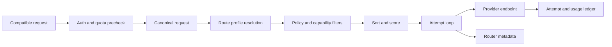
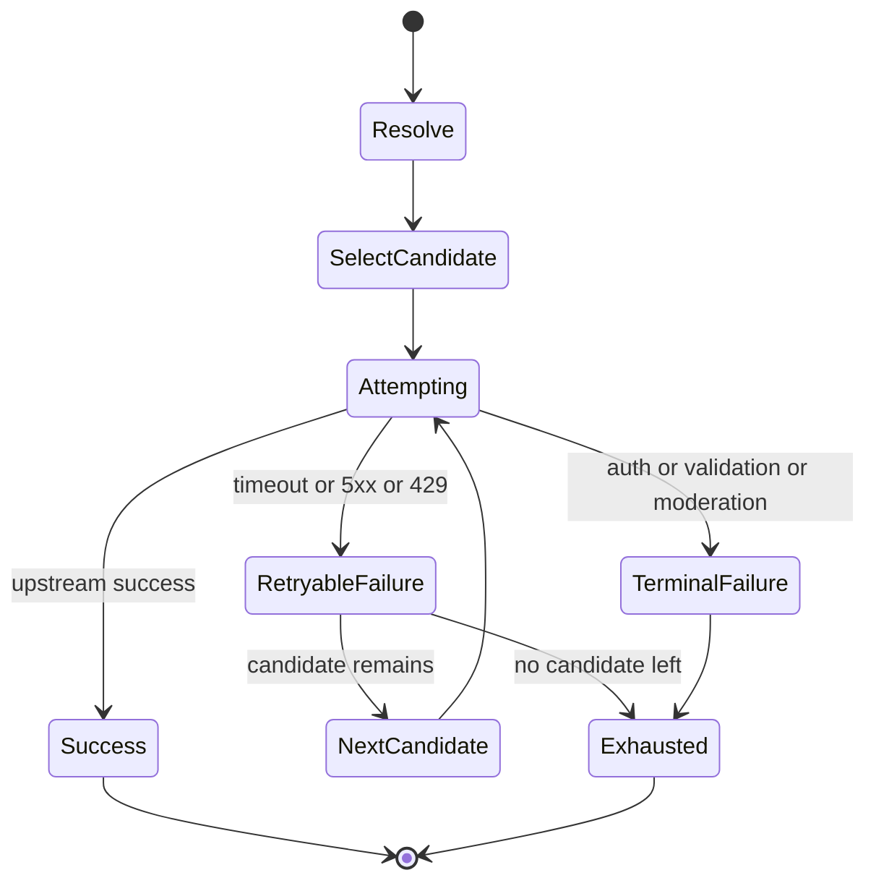

# AIYolo Gateway Routing 设计

本文档细化 AIYolo 在多 Provider、多协议、多路由策略场景下的选路设计。目标不是重新定义一套抽象框架，而是在当前 Go 单体网关已经具备的模型别名、Provider、Proxy Profile、配额和审计能力之上，补齐可生产化的路由决策面。

相关背景文档：

- [docs/api-gateway-console-design.md](./api-gateway-console-design.md)
- [docs/openrouter-feature-inventory.md](./openrouter-feature-inventory.md)

当前代码基线：

- 网关请求入口在 [internal/gateway/handlers.go](../internal/gateway/handlers.go)
- 当前路由解析逻辑在 [internal/gateway/handlers.go](../internal/gateway/handlers.go)
- Provider、Model Route、Proxy Profile 结构定义在 [internal/domain/types.go](../internal/domain/types.go)
- 初始数据库表定义在 [internal/storage/migrations/000001_init.up.sql](../internal/storage/migrations/000001_init.up.sql)

## 1. 目标与非目标

### 1.1 目标

- 对外继续暴露稳定的 public model 名称，内部可自由切换 Provider endpoint 和真实模型。
- 支持 OpenAI-compatible、Anthropic-compatible、OpenRouter-compatible 请求在同一网关内做统一路由。
- 把价格、可用性、延迟、吞吐、ZDR、数据策略、参数兼容性纳入候选过滤与排序。
- 把每次路由尝试写成可审计事实，支持控制台 Audit、Usage、Logs 和后续 router metadata。
- 为后续跨模型 fallback、BYOK、区域路由和 Guardrails 预留清晰扩展点。

### 1.2 非目标

- 不在 P0 阶段引入独立路由微服务；仍采用当前 Go 单体内联决策。
- 不在 P0 阶段实现复杂机器学习打分或长期自适应优化。
- 不在 P0 阶段做“已经开始向客户端输出后”的 mid-stream 跨 Provider 重试。

## 2. 当前实现基线

当前代码中的路由链路非常直接：

1. 解析请求中的 `model`。
2. 通过 `GetModelRoute(model)` 查到一条 `model_routes` 记录。
3. 通过 `route.ProviderID` 读取一个 `providers` 记录。
4. 代理出口按 `route.ProxyProfileID -> provider.DefaultProxyID -> direct` 决定。
5. 将请求中的 `model` 改写为 `route.UpstreamModel` 后直接发往上游。

这一版已经具备几个重要基石：

- public model 与 upstream model 解耦。
- Provider 支持 `supported_protocols`，说明一个上游可以同时承载 OpenAI 和 Anthropic 兼容面。
- 配额预留发生在真正发起上游调用前，意味着路由阶段已经是计费链路的一部分。
- 审计日志已记录 `provider_id`、`upstream_model`、`proxy_profile_id`、`status_code` 和 token/cost。

当前不足：

- 一个 public model 只能解析到一条生效路由，无法表达同模型多 endpoint 候选。
- 没有显式的 provider endpoint 概念，也没有健康窗口与冷却时间。
- 没有请求级 provider preferences、跨模型 fallback、区域和数据策略过滤。
- 失败请求只有最终结果，没有 attempt 级事实表。

## 3. 路由术语

| 术语 | 含义 |
| --- | --- |
| `public model` | 对外暴露给客户端的稳定模型名，例如 `claude-openrouter`。 |
| `route profile` | public model 的路由策略定义，描述候选集来源、默认排序和 fallback 规则。 |
| `provider endpoint` | 可实际发起请求的最小运行单元，包含 Provider、协议、区域、URL、价格和健康状态。 |
| `candidate` | 某次请求在过滤与排序之后得到的可尝试 endpoint。 |
| `attempt` | 对一个 candidate 发起的一次真实调用。 |
| `generation` | 客户端触发的一次完整请求，可能包含多个 attempt。 |
| `health window` | 滚动时间窗口内的错误率、超时率、延迟和吞吐统计。 |
| `router metadata` | 返回给客户端或写入审计的路由快照，解释为何选中某个 candidate。 |

## 4. 目标架构



控制面分为两层：

- 配置层：定义 public model、Provider、Provider endpoint、默认路由策略、Workspace 默认值、Guardrails。
- 运行层：按请求把候选 endpoint 拉平、过滤、排序、尝试、记录。

## 5. 数据模型扩展

### 5.1 保留并复用的现有表

- `providers`：继续代表供应商逻辑分组和密钥边界。
- `model_routes`：从“单条真实路由”提升为“public model 的默认路由入口”。
- `proxy_profiles`：继续表示网络出口配置。
- `pricing_rules`：继续保存价格规则，但将逐步演进为价格快照来源之一。
- `usage_ledger` 和 `audit_logs`：继续作为最终结算和运营查询事实表。

### 5.2 新增表

#### `provider_endpoints`

用于表示同一 Provider 下可单独筛选、排序、健康检查的真实入口。

建议字段：

| 字段 | 说明 |
| --- | --- |
| `id` | 稳定 endpoint id。 |
| `provider_id` | 所属 Provider。 |
| `display_name` | 控制台展示名。 |
| `base_url` | 实际请求基础地址，可覆盖 Provider 默认值。 |
| `protocols` | 支持的兼容协议集合。 |
| `region` | 数据驻留和延迟标签。 |
| `capability_tags` | tools、structured_outputs、reasoning、multimodal 等能力标签。 |
| `data_collection_policy` | `allow` 或 `deny`。 |
| `supports_zdr` | 是否支持零数据保留。 |
| `supports_byok` | 是否可承载 BYOK。 |
| `quantization` | int4、fp8、bf16 等可选标签。 |
| `priority` | 同 Provider 下的静态优先级。 |
| `weight` | 同价位或同组候选时的权重。 |
| `status` | enabled、disabled、draining。 |
| `timeout_seconds` | endpoint 级超时。 |
| `default_proxy_profile_id` | endpoint 级默认出口。 |
| `last_health_state` | healthy、degraded、cooldown、unhealthy。 |
| `last_health_change_at` | 最近健康状态变化时间。 |

#### `routing_policies`

保存 public model、workspace、guardrail 或系统默认的路由策略模板。

建议字段：

| 字段 | 说明 |
| --- | --- |
| `id` | 策略 id。 |
| `scope_type` | `system`、`workspace`、`model_route`。 |
| `scope_id` | 对应作用域 id。 |
| `strategy` | `direct`、`fallback`、`cost_first`、`latency_first`、`throughput_first`。 |
| `fallback_models` | 请求未显式提供 `models[]` 时的默认 fallback 列表。 |
| `provider_order` | 默认显式顺序。 |
| `allow_fallbacks` | 是否允许跳出显式顺序。 |
| `require_parameters` | 是否强制候选支持全部请求参数。 |
| `data_collection` | `allow` 或 `deny`。 |
| `require_zdr` | 是否只允许 ZDR 端点。 |
| `max_price_prompt` | 输入单价上限。 |
| `max_price_completion` | 输出单价上限。 |
| `preferred_region` | 区域偏好。 |
| `sort` | `price`、`latency`、`throughput`、`priority`。 |

#### `routing_attempts`

记录一次 generation 下的所有尝试。

建议字段：

| 字段 | 说明 |
| --- | --- |
| `id` | attempt id。 |
| `generation_id` | 关联 generation。 |
| `request_id` | 外部请求 id。 |
| `attempt_index` | 第几次尝试，从 1 开始。 |
| `public_model` | 客户端请求模型。 |
| `resolved_model` | 本次尝试使用的 upstream model。 |
| `provider_id` | Provider。 |
| `provider_endpoint_id` | 实际 endpoint。 |
| `proxy_profile_id` | 最终出口。 |
| `protocol` | 兼容协议。 |
| `filter_snapshot` | 被保留候选与过滤原因快照。 |
| `sort_snapshot` | 排序依据与分数。 |
| `status` | `selected`、`succeeded`、`failed`、`skipped`。 |
| `failure_class` | timeout、rate_limit、moderation、context_limit、upstream_5xx 等。 |
| `status_code` | 上游或映射后的状态码。 |
| `latency_ms` | 本次尝试耗时。 |
| `input_tokens_estimate` | 尝试前估算输入。 |
| `created_at` | 创建时间。 |

#### `provider_health_windows`

按 endpoint 记录滚动窗口统计。

建议字段：

| 字段 | 说明 |
| --- | --- |
| `provider_endpoint_id` | endpoint。 |
| `window_start` | 窗口起点。 |
| `window_seconds` | 窗口长度，例如 60、300、900。 |
| `request_count` | 总请求数。 |
| `success_count` | 成功数。 |
| `failure_count` | 失败数。 |
| `timeout_count` | 超时数。 |
| `rate_limit_count` | 429 数。 |
| `moderation_count` | 内容拦截数。 |
| `latency_p50/p95/p99` | 延迟分位。 |
| `throughput_p50/p95` | 输出吞吐分位。 |

## 6. 请求归一化与候选生成

### 6.1 归一化输入

路由层不直接对 OpenAI、Anthropic、OpenRouter 三种原始请求做 if/else 分支扩散，而是先提炼为 `CanonicalRequest`。建议至少包含：

- `request_id`
- `protocol`
- `public_model`
- `fallback_models[]`
- `stream`
- `tooling`
- `structured_output_required`
- `service_tier`
- `max_tokens`
- `context_tokens_estimate`
- `provider_preferences`
- `workspace_id`
- `api_key_id`
- `user_id`

其中 `provider_preferences` 对应 OpenRouter 的 `provider` 对象，并允许未来控制台 preset、workspace 默认值叠加。

### 6.2 候选来源优先级

候选来源按下列顺序收敛：

1. 请求级显式 `models[]`。
2. 请求级 `route` 或 `provider` 偏好。
3. public model 绑定的 `routing_policy`。
4. workspace 默认路由策略。
5. 系统默认策略。

同一 public model 最终会得到一组扁平化 candidate：

- `(public_model, provider_endpoint_1, upstream_model_A)`
- `(public_model, provider_endpoint_2, upstream_model_A)`
- `(fallback_model_B, provider_endpoint_3, upstream_model_B)`

## 7. 过滤规则

候选生成后，按固定顺序过滤，保证 metadata 可解释。

### 7.1 硬过滤

- 协议不兼容。
- Provider 或 endpoint 被禁用。
- model route 禁用。
- Workspace 或 API Key 不允许该 public model。
- endpoint 不支持请求中出现的强制参数。
- endpoint 违反 `data_collection = deny`。
- 请求要求 ZDR，但 endpoint 不支持。
- 请求要求区域，但 endpoint 区域不匹配。
- endpoint 超过 `max_price`。
- endpoint 正处于 cooldown。

### 7.2 软过滤与降级

如果硬过滤后候选为空，可在 `allow_fallbacks = true` 时进入宽松模式：

- 去掉显式 `provider.order` 之外的限制。
- 从同模型扩展到 fallback 模型。
- 从首选区域扩展到同主权边界区域。

宽松模式必须写入 metadata 和 audit，避免“用户明明指定 only，却被偷偷换路”。

## 8. 排序与默认策略

### 8.1 P0 默认策略

P0 采用确定性排序，规则如下：

1. 先排除 `unhealthy` 与 `cooldown` endpoint。
2. 优先选择更低价格。
3. 同价格按更小 `priority`。
4. 再按更大 `weight`。
5. 仍相同时按 `provider_endpoint_id` 字典序稳定排序。

这一策略与当前实现最接近，易于验证，也便于从现有单路由模型平滑升级。

### 8.2 P1 默认策略

P1 将价格优先扩展为“价格优先但考虑短期健康”的策略：

- 仅在健康候选池内做排序。
- 价格得分为主。
- 在相近价格候选中，用近期可用性和延迟打破平局。
- 对连续失败的 endpoint 应用 cooldown，避免雪崩。

建议评分函数只用于排序，不直接暴露给用户：

- `score = price_score + health_bonus + latency_bonus + throughput_bonus`

P1 仍保持确定性排序，暂不做完全随机化。

### 8.3 显式排序

请求级 `provider.sort` 覆盖默认排序：

| 值 | 行为 |
| --- | --- |
| `price` | 单价最低优先。 |
| `latency` | 延迟最低优先。 |
| `throughput` | 吞吐最高优先。 |
| `priority` | 静态优先级优先。 |

如果请求同时提供 `provider.order`，则排序只在该顺序分组内部进行，不得越过显式顺序。

## 9. 健康窗口与 cooldown

### 9.1 健康状态

| 状态 | 含义 |
| --- | --- |
| `healthy` | 最近窗口内错误率与延迟正常。 |
| `degraded` | 有明显异常，但仍可作为 fallback 候选。 |
| `cooldown` | 短时间内连续失败，暂时不参与默认选择。 |
| `unhealthy` | 明确不可用，只有手动或后台健康探针恢复后才重新启用。 |

### 9.2 触发规则建议

- 连续 3 次连接失败或 5xx，进入 `cooldown` 60 秒。
- 60 秒窗口错误率超过 50%，进入 `degraded`。
- 连续 3 个窗口错误率超过阈值，升级为 `unhealthy`。
- 成功请求数连续恢复后，按 `cooldown -> degraded -> healthy` 逐步恢复。

### 9.3 不应记入健康衰减的失败类型

以下失败通常表示请求本身不适配，不应直接拉低 endpoint 健康：

- 客户端参数错误。
- context length 超限。
- moderation block。
- API Key 权限不允许。

这些仍要记录在 `routing_attempts.failure_class` 中，但只影响兼容性分析，不影响链路健康。

## 10. Fallback 状态机



### 10.1 可重试失败

- 网络错误。
- TCP/TLS 建连失败。
- 上游 408、429、502、503、504。
- endpoint 被健康窗口即时判为 cooldown。

### 10.2 终止失败

- 认证失败。
- 请求体不兼容。
- 参数不被支持，且 `require_parameters = true`。
- moderation block。
- 客户端已断开连接。

### 10.3 Streaming 特例

一旦已经向客户端输出首个有效 token 或 SSE chunk：

- 不再切换到新 candidate。
- 仅记录当前 attempt 失败，并将错误包装成兼容格式返回。
- usage ledger 记为部分完成或失败完成。

## 11. Proxy 选择顺序

路由最终确定 candidate 后，再决策网络出口。优先级如下：

1. 请求显式绑定的临时 proxy profile。
2. route 绑定的 `proxy_profile_id`。
3. provider endpoint 默认 proxy。
4. provider 默认 proxy。
5. workspace 默认 proxy。
6. `direct`。

这一顺序与当前 console [internal/console/templates/proxies.html](../internal/console/templates/proxies.html) 中描述的决策顺序保持一致，只是补上了 endpoint 和 workspace 两层。

## 12. Router Metadata

请求头启用：

- `X-OpenRouter-Experimental-Metadata: enabled`

AIYolo 建议返回字段：

```json
{
  "aiyolo_metadata": {
    "requested": "claude-openrouter",
    "resolved_model": "anthropic/claude-sonnet-4",
    "strategy": "cost_first",
    "attempt": 2,
    "is_byok": false,
    "region": "us",
    "summary": "primary endpoint timed out, fallback to cheaper healthy candidate",
    "endpoints": {
      "total": 4,
      "available": [
        {"provider": "openrouter", "endpoint": "or-us-1", "selected": false},
        {"provider": "openrouter", "endpoint": "or-us-2", "selected": true}
      ]
    },
    "attempts": [
      {"index": 1, "provider": "openrouter", "endpoint": "or-us-1", "status": "timeout"},
      {"index": 2, "provider": "openrouter", "endpoint": "or-us-2", "status": "success"}
    ],
    "filters": [
      {"stage": "zdr", "removed": 1},
      {"stage": "max_price", "removed": 2}
    ]
  }
}
```

规则：

- 非流式响应直接放到响应体顶层扩展字段。
- 流式响应放到最终 terminal chunk。
- cache hit 可不返回完整 metadata，但要返回 `cache_status`。
- 认证失败和早期请求校验失败可不返回 metadata。

## 13. 与现有实现的衔接

### 13.1 P0

在不改变外部 API 的前提下，先完成以下重构：

1. 把 `resolveRoute` 从“返回单条 route + provider + proxy”升级为“返回 candidate 列表”。
2. 将现有 `model_routes` 记录视作默认 candidate 生成源。
3. 新增 `routing_attempts` 表，哪怕初期每个 request 只有一条 attempt 也先写入。
4. 在 `audit_logs` 中补充 `generation_id` 和 `attempt_index`。

### 13.2 P1

1. 引入 `provider_endpoints` 和 `provider_health_windows`。
2. 支持 `models[]` fallback 和 `provider.only/ignore/order/sort`。
3. 在控制台新增 Routing 页面。
4. 开始输出 router metadata。

### 13.3 P2

1. 引入 throughput、latency 统计排序。
2. 加入 sticky routing，用于 prompt cache 命中优化。
3. 加入区域与数据主权策略。
4. 为 BYOK 和 quality-first routing 预留扩展评分项。

## 14. 失败分类规范

建议统一的 `failure_class`：

| 类别 | 例子 |
| --- | --- |
| `network_error` | dial timeout、TLS handshake failed |
| `upstream_4xx` | 400、403、404 |
| `rate_limited` | 429 |
| `upstream_5xx` | 500、502、503、504 |
| `moderation_block` | 上游内容审核拒绝 |
| `context_limit` | prompt 超过上下文限制 |
| `parameter_mismatch` | 不支持工具或结构化输出 |
| `client_cancelled` | 客户端断流或主动取消 |

该分类既用于健康窗口，也用于控制台 Audit 页的快速筛选。

## 15. 控制台落点

为避免路由能力只存在于后端，控制台至少需要新增：

- Routing 页面：编辑系统默认策略、workspace 默认策略和 model route 策略。
- Providers 页面：从“Provider”扩展为“Provider + Endpoint”。
- Models 页面：展示 public model 的候选 endpoint、fallback 模型和价格上限。
- Audit 页面：展示 attempt 级时间线而不只是 request 级结果。

细节拆分见后续文档 [docs/gateway-console-pages.md](./gateway-console-pages.md)。

## 16. 决策摘要

- public model 仍是稳定对外契约，不直接暴露 endpoint 概念。
- endpoint 是运行时最小调度单位，健康状态和价格都挂在这一层。
- route policy 负责“候选如何生成”，health window 负责“候选能否参与”，attempt ledger 负责“为什么选它和它表现如何”。
- P0 先做确定性策略与 attempt 事实表，P1 再补全 OpenRouter 风格的 provider preferences 和跨模型 fallback。